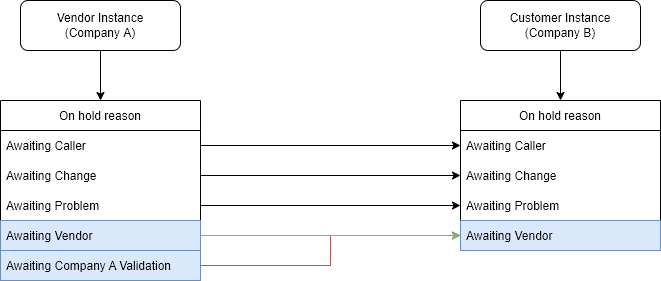
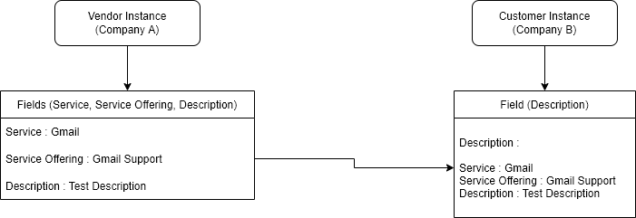
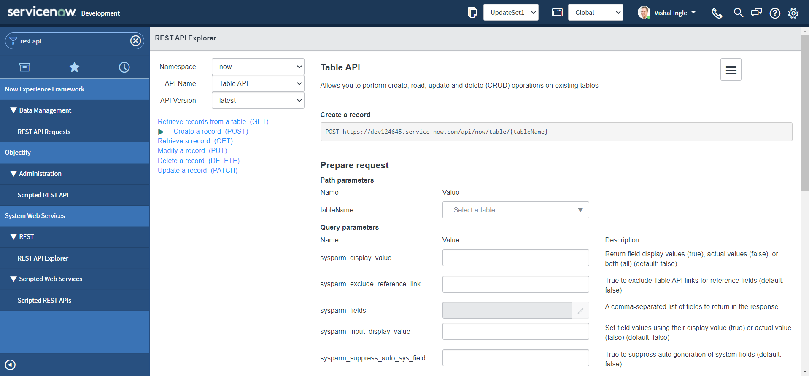
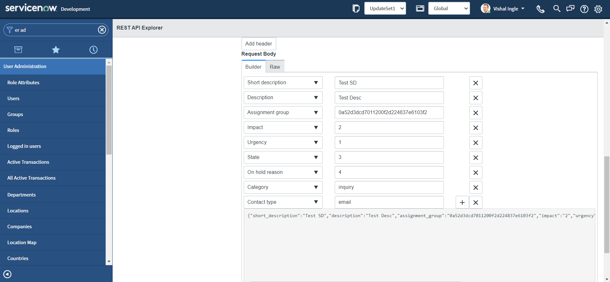
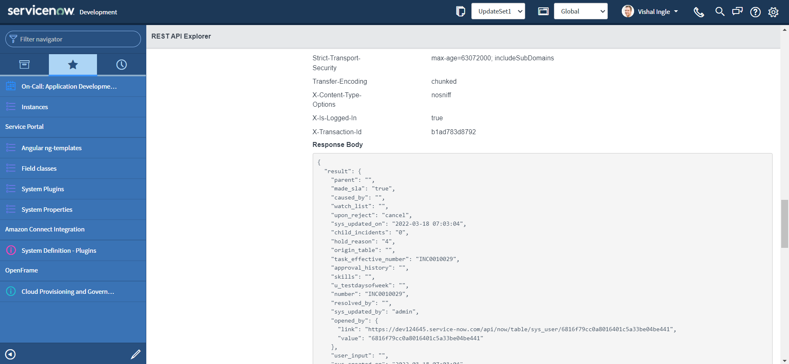
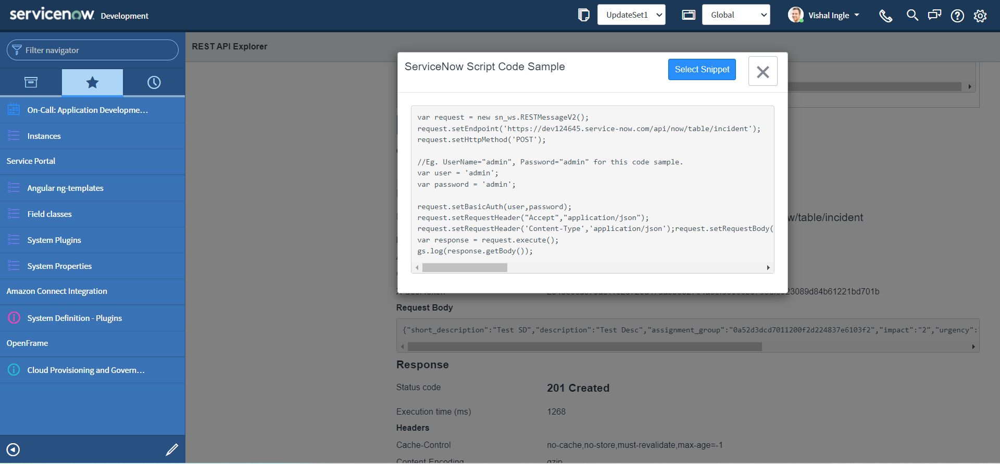

## Chapter 4 (Draft)

# Implementing Our First Integration

## A clearer picture

&nbsp;&nbsp;&nbsp;&nbsp;Till this point, we have seen what Inbound integration is in the context of ServiceNow, got familier with REST API explorer and got a faded picture of what we will be implementing in our first integration. I feel this is a perfect time to make that picture more clear. Please refer the following image:


&nbsp;&nbsp;&nbsp;&nbsp;The above image specifies that whenever an incident is created on Vendor (Company A) instance with a specific Service and assigned to Specific group (both of them should be predefined by business), The copy of incident is created on Customer (Company B) instance and assigned to specific assignment group (also predefined by business).

&nbsp;&nbsp;&nbsp;&nbsp;So straightforward right? Well, no! When you will work on real life implementations you will notice that there is always a tweak, if not you are just lucky. Please refer the following image:



&nbsp;&nbsp;&nbsp;&nbsp;As we can notice from the above image,our Vendor (Company A) instance has an additional On hold reason choice "Awaiting Company A Validation" (for some internal validation). Whereas our Customer (Company B) instance has all Out of the box (OOTB) choices. So our first tweak is we need to map our custom choice "Awaiting Company A Validation" from the Vendor instance to the "Awaiting Vendor" on the Customer i.e. Company B instance.

&nbsp;&nbsp;&nbsp;&nbsp;Those who are unaware about what these OOTB choices mean, you should read the answer to the community question by Mark Stanger, which can be found [here](https://community.servicenow.com/community?id=community_question&sys_id=23e90220dbc0eb805129a851ca9619f2). For ease i will replicate the original response here :

- **Awaiting Caller:** Waiting on a response back from the caller after the technician has requested additional information.
- **Awaiting Problem:** Problem record has been opened from (or associated to) the incident and you're waiting for more information from the problem management process before continuing on.
- **Awaiting Change:** Change record has been opened from (or associated to) the incident and you're waiting for more information from the change management process before continuing on.
- **Awaiting Vendor:** Waiting on information from a vendor assisting with resolution of the incident.

&nbsp;&nbsp;&nbsp;&nbsp;Now, it is time for another tweak. Please refer the following images:


&nbsp;&nbsp;&nbsp;&nbsp;As you can notice from the above image, We have an additional Contact type "API" on Customer instance and no matter through which channel the incident is created on Vendor instance, the target incident on Customer instance should have the Contact type set as "API".

&nbsp;&nbsp;&nbsp;&nbsp;We also have the requirement to always map the incident to the "Inquiry / Help" category on Customer instance:


&nbsp;&nbsp;&nbsp;&nbsp;And finally, we need to map the Service, Service Offering and the Description to the Description field (the justification could be that the CMDB is not implemented properly yet on Customer instance):



&nbsp;&nbsp;&nbsp;&nbsp;For other fields that are shown below it is straightforward, we will map them as is:


&nbsp;&nbsp;&nbsp;&nbsp;Okay, we can include many other things but for now we already have much complex requirement for our first integration and we are good to go.

## Create the code sample

&nbsp;&nbsp;&nbsp;&nbsp;The REST API Explorer creates the code samples for integrating with the ServiceNow APIs in several commonly used languages in addition to **ServiceNow Script** snippet, These are:

- cURL
- Python
- Ruby
- JavaScript
- Perl
- Powershell

&nbsp;&nbsp;&nbsp;&nbsp;For our purpose, we are going to use the REST API Explorer to create the snippet to create an incident. You can refer [Chapter 3: REST API Explorer](/Chapter3_RESTAPIExplorer.md) for more detailed explaination:

- Navigate to **System Web Services > REST > REST API Explorer**.
  
- In the top-left of the REST API Explorer, click **Create a record (POST)**.
  
- In the Path Parameters section, select the **Incident (incident)** table.
  
- In the Request Body section, click **Add a field**.
  
- Select a field and specify a value for the field **"Short description"** as "Test SD" or whatever you may like:
  
- Click the plus sign **(+)** and specify additional fields:

  - **Description**: Test Desc
  - **Assignment group**: 0a52d3dcd7011200f2d224837e6103f2
  - **Impact**: 2
  - **Urgency**: 1
  - **State**: 3
  - **On hold reason**: 4
  - **Category**: inquiry
  - **Contact type**: email



- The request body updates automatically based on your entries (shown in the above image), such as:

```json
{
  "short_description": "Test SD",
  "description": "Test Desc",
  "assignment_group": "0a52d3dcd7011200f2d224837e6103f2",
  "impact": "2",
  "urgency": "1",
  "state": "3",
  "hold_reason": "4",
  "category": "inquiry",
  "contact_type": "email"
}
```

- We did use all the test values here, as we do not have our instances ready yet for our use case discussed, but we are good to go. After constructing the request, click **Send**. For pop-up, select **OK**.
  
  

&nbsp;&nbsp;&nbsp;&nbsp;The response includes a Location header that specifies where the incident was created and how to retrieve the incident. The response also indicates the Status code and Execution time (in milliseconds) of the request.



&nbsp;&nbsp;&nbsp;&nbsp;Now, let us verify if the incident really is created.

- Note down the **number** property from the respose body.
  
- Navigate to **Incident > Open** in a new tab, verify that the incident is created with the provided information:
  
  

&nbsp;&nbsp;&nbsp;&nbsp;Once you are satified with the testing, It is now time to generate the snippet and move to the next step:

- To create the code sample, Navigate back to REST API Explorer window and click the link for the language of your choice in the REST API Explorer. For the sake of this example, we will select **"ServiceNow Script"**.
  
- To highlight the code sample for copying, click the **Select Snippet** button.
  
- After highlighting the code sample, **copy the code sample to the clipboard** by using ctrl+c.
  

&nbsp;&nbsp;&nbsp;&nbsp;If you did everything correctly you should have the code which look similar to the following copied to your clipboard:

```js
var request = new sn_ws.RESTMessageV2()
request.setEndpoint("https://dev124645.service-now.com/api/now/table/incident")
request.setHttpMethod("POST")

//Eg. UserName="admin", Password="admin" for this code sample.
var user = "admin"
var password = "admin"

request.setBasicAuth(user, password)
request.setRequestHeader("Accept", "application/json")
request.setRequestHeader("Content-Type", "application/json")
request.setRequestBody(
  '{"short_description":"Test SD","description":"Test Desc","assignment_group":"0a52d3dcd7011200f2d224837e6103f2","impact":"2","urgency":"1","state":"3","hold_reason":"4","category":"inquiry","contact_type":"email"}'
)
var response = request.execute()
gs.log(response.getBody())
```

## Setting up the stage

&nbsp;&nbsp;&nbsp;&nbsp;Once we have our code sample copied, we can use it any server side code such as Business rules, Script includes, Workflows etc. But this code is of no use yet unless we make a very small adjustment to it:

- It is time to visit our old good friend. Use the Application Navigator to open **System Definition > Scripts - Background**.
  
- Paste the snippet that we did copy from last section into the Run Script field And Click the **Run script** button to view the results of the script.
  
  

  &nbsp;&nbsp;&nbsp;&nbsp;Oops, You should receive the **User Not Authenticated** error and I am sure that you did not expect that. All the code samples generated through the REST API Explorer uses fake credentials. Before using the script in the application to integrate with ServiceNow, we need to update the code to use valid credentials.

  &nbsp;&nbsp;&nbsp;&nbsp;Let us modify our code to change the fake credentials by your admin credentials, and re-execute the script:

```js
var request = new sn_ws.RESTMessageV2()
request.setEndpoint("https://dev124645.service-now.com/api/now/table/incident")
request.setHttpMethod("POST")

//Eg. UserName="admin", Password="admin" for this code sample.
var user = "MyAdminUserName"
var password = "MyAdminPassword"

request.setBasicAuth(user, password)
request.setRequestHeader("Accept", "application/json")
request.setRequestHeader("Content-Type", "application/json")
request.setRequestBody(
  '{"short_description":"Test SD","description":"Test Desc","assignment_group":"0a52d3dcd7011200f2d224837e6103f2","impact":"2","urgency":"1","state":"3","hold_reason":"4","category":"inquiry","contact_type":"email"}'
)
var response = request.execute()
gs.log(response.getBody())
```


&nbsp;&nbsp;&nbsp;&nbsp;The above output indicates that our API successfully created the incident. But you surely do not want to expose your admin credentials (and give full control of your instance) to others. And for this purpose and for every integration you will find a Service Account created on the target tool, Let us create one on our Customer instance.

### Service Account

&nbsp;&nbsp;&nbsp;&nbsp;Service Account:
