## Chapter 4

# Implementing Our First Integration

## A clearer picture

&nbsp;&nbsp;&nbsp;&nbsp;Till this point, we have seen what Inbound integration is in the context of ServiceNow, got familier with REST API explorer and got a faded picture of what we will be implementing in our first integration. I feel this is a perfect time to make that picture more clear. Please refer the following image:

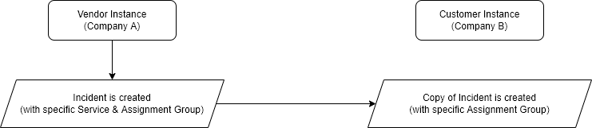

&nbsp;&nbsp;&nbsp;&nbsp;The above image specifies that whenever an incident is created on Vendor (Company A) instance with a specific Service and assigned to Specific group (both of them should be predefined by business), The copy of incident is created on Customer (Company B) instance and assigned to specific assignment group (also predefined by business).

&nbsp;&nbsp;&nbsp;&nbsp;So straightforward right? Well, no! When you will work on real life implementations you will notice that there is always a tweak, if not you are just lucky. Please refer the following image:


&nbsp;&nbsp;&nbsp;&nbsp;As we can notice from the above image,our Vendor (Company A) instance has an additional On hold reason choice "Awaiting Company A Validation" (for some internal validation). Whereas our Customer (Company B) instance has all Out of the box (OOTB) choices. So our first tweak is we need to map our custom choice "Awaiting Company A Validation" from the Vendor instance to the "Awaiting Vendor" on the Customer i.e. Company B instance.

&nbsp;&nbsp;&nbsp;&nbsp;Those who are unaware about what these OOTB choices mean, you should read the answer to the community question by Mark Stanger, which can be found [here](https://community.servicenow.com/community?id=community_question&sys_id=23e90220dbc0eb805129a851ca9619f2). For ease i will replicate the original response here :

- **Awaiting Caller:** Waiting on a response back from the caller after the technician has requested additional information.
- **Awaiting Problem:** Problem record has been opened from (or associated to) the incident and you're waiting for more information from the problem management process before continuing on.
- **Awaiting Change:** Change record has been opened from (or associated to) the incident and you're waiting for more information from the change management process before continuing on.
- **Awaiting Vendor:** Waiting on information from a vendor assisting with resolution of the incident.

&nbsp;&nbsp;&nbsp;&nbsp;Now, it is time for another tweak. Please refer the following images:


&nbsp;&nbsp;&nbsp;&nbsp;As you can notice from the above image, We have an additional Contact type "API" on Customer instance and no matter through which channel the incident is created on Vendor instance, the target incident on Customer instance should have the Contact type set as "API".

&nbsp;&nbsp;&nbsp;&nbsp;We also have the requirement to always map the incident to the "Inquiry / Help" category on Customer instance:


&nbsp;&nbsp;&nbsp;&nbsp;And finally, we need to map the Service, Service Offering and the Description to the Description field (the justification could be that the CMDB is not implemented properly yet on Customer instance):


&nbsp;&nbsp;&nbsp;&nbsp;For other fields that are shown below it is straightforward, we will map them as is:

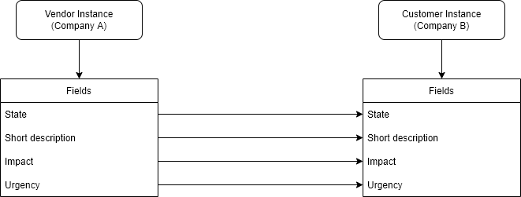

&nbsp;&nbsp;&nbsp;&nbsp;Okay, we can include many other things but for now we already have much complex requirement for our first integration and we are good to go.

## Create the code sample

&nbsp;&nbsp;&nbsp;&nbsp;The REST API Explorer creates the code samples for integrating with the ServiceNow APIs in several commonly used languages in addition to **ServiceNow Script** snippet, These are:

- cURL
- Python
- Ruby
- JavaScript
- Perl
- Powershell

&nbsp;&nbsp;&nbsp;&nbsp;For our purpose, we are going to use the REST API Explorer to create the snippet to create an incident. You can refer [Chapter 3: REST API Explorer](/Chapter3_RESTAPIExplorer.md) for more detailed explaination:

- Navigate to **System Web Services > REST > REST API Explorer**.
  
- In the top-left of the REST API Explorer, click **Create a record (POST)**.
  
- In the Path Parameters section, select the **Incident (incident)** table.
  
- In the Request Body section, click **Add a field**.
  
- Select a field and specify a value for the field **"Short description"** as "Test SD" or whatever you may like:
  
- Click the plus sign **(+)** and specify additional fields:

  - **Description**: Test Desc
  - **Assignment group**: 0a52d3dcd7011200f2d224837e6103f2
  - **Impact**: 2
  - **Urgency**: 1
  - **State**: 3
  - **On hold reason**: 4
  - **Category**: inquiry
  - **Contact type**: email


- The request body updates automatically based on your entries (shown in the above image), such as:

```json
{
  "short_description": "Test SD",
  "description": "Test Desc",
  "assignment_group": "0a52d3dcd7011200f2d224837e6103f2",
  "impact": "2",
  "urgency": "1",
  "state": "3",
  "hold_reason": "4",
  "category": "inquiry",
  "contact_type": "email"
}
```

- We did use all the test values here, as we do not have our instances ready yet for our use case discussed, but we are good to go. After constructing the request, click **Send**. For pop-up, select **OK**.
  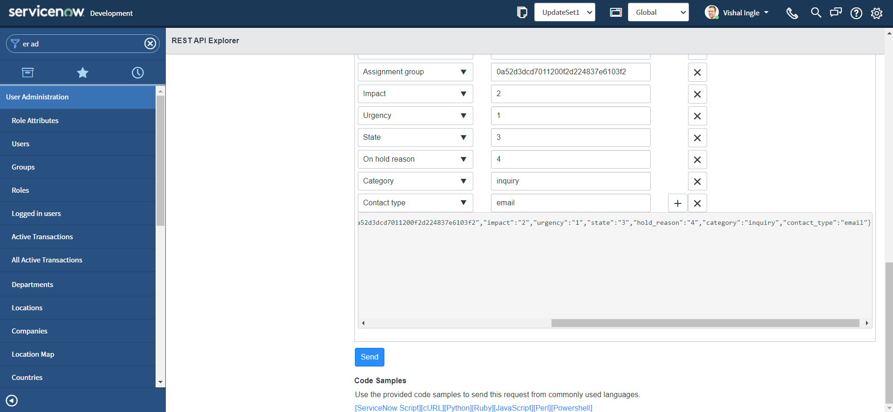
  

&nbsp;&nbsp;&nbsp;&nbsp;The response includes a Location header that specifies where the incident was created and how to retrieve the incident. The response also indicates the Status code and Execution time (in milliseconds) of the request.


&nbsp;&nbsp;&nbsp;&nbsp;Now, let us verify if the incident really is created.

- Note down the **number** property from the respose body.
  
- Navigate to **Incident > Open** in a new tab, verify that the incident is created with the provided information:
  
  

&nbsp;&nbsp;&nbsp;&nbsp;Once you are satified with the testing, It is now time to generate the snippet and move to the next step:

- To create the code sample, Navigate back to REST API Explorer window and click the link for the language of your choice in the REST API Explorer. For the sake of this example, we will select **"ServiceNow Script"**.
  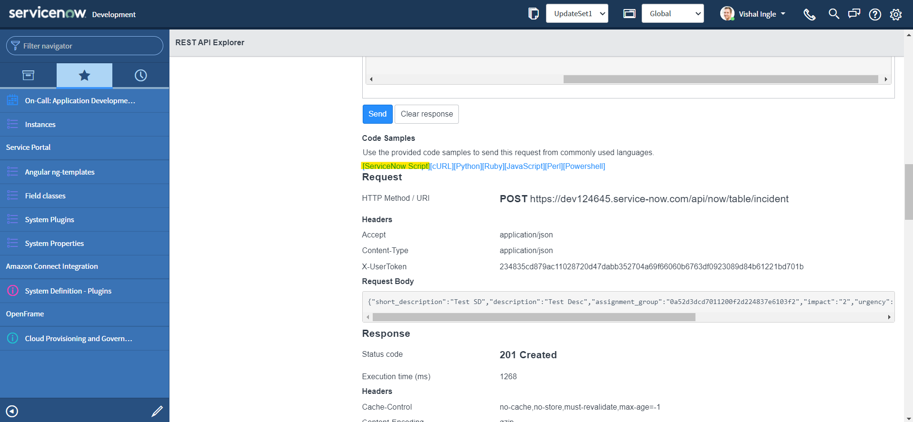
- To highlight the code sample for copying, click the **Select Snippet** button.
  
- After highlighting the code sample, **copy the code sample to the clipboard** by using ctrl+c.
  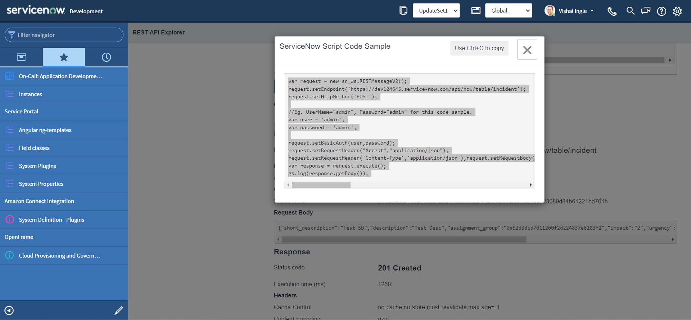

&nbsp;&nbsp;&nbsp;&nbsp;If you did everything correctly you should have the code which look similar to the following copied to your clipboard:

```js
var request = new sn_ws.RESTMessageV2()
request.setEndpoint("https://dev124645.service-now.com/api/now/table/incident")
request.setHttpMethod("POST")

//Eg. UserName="admin", Password="admin" for this code sample.
var user = "admin"
var password = "admin"

request.setBasicAuth(user, password)
request.setRequestHeader("Accept", "application/json")
request.setRequestHeader("Content-Type", "application/json")
request.setRequestBody(
  '{"short_description":"Test SD","description":"Test Desc","assignment_group":"0a52d3dcd7011200f2d224837e6103f2","impact":"2","urgency":"1","state":"3","hold_reason":"4","category":"inquiry","contact_type":"email"}'
)
var response = request.execute()
gs.log(response.getBody())
```

## Setting up the stage

&nbsp;&nbsp;&nbsp;&nbsp;Once we have our code sample copied, we can use it any server side code such as Business rules, Script includes, Workflows etc. But this code is of no use yet unless we make a very small adjustment to it:

- It is time to visit our old good friend. Use the Application Navigator to open **System Definition > Scripts - Background**.
  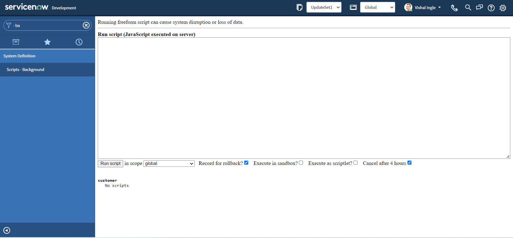
- Paste the snippet that we did copy from last section into the Run Script field And Click the **Run script** button to view the results of the script.
  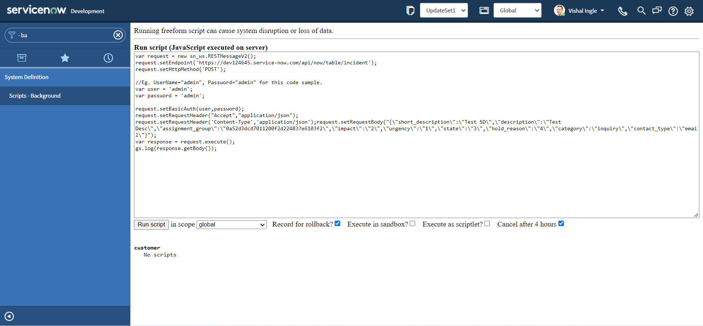
  

  &nbsp;&nbsp;&nbsp;&nbsp;Oops, You should receive the **User Not Authenticated** error and I am sure that you did not expect that. All the code samples generated through the REST API Explorer uses fake credentials. Before using the script in the application to integrate with ServiceNow, we need to update the code to use valid credentials.

  &nbsp;&nbsp;&nbsp;&nbsp;Let us modify our code to change the fake credentials by your admin credentials, and re-execute the script:

```js
var request = new sn_ws.RESTMessageV2()
request.setEndpoint("https://dev124645.service-now.com/api/now/table/incident")
request.setHttpMethod("POST")

//Eg. UserName="admin", Password="admin" for this code sample.
var user = "MyAdminUserName"
var password = "MyAdminPassword"

request.setBasicAuth(user, password)
request.setRequestHeader("Accept", "application/json")
request.setRequestHeader("Content-Type", "application/json")
request.setRequestBody(
  '{"short_description":"Test SD","description":"Test Desc","assignment_group":"0a52d3dcd7011200f2d224837e6103f2","impact":"2","urgency":"1","state":"3","hold_reason":"4","category":"inquiry","contact_type":"email"}'
)
var response = request.execute()
gs.log(response.getBody())
```


&nbsp;&nbsp;&nbsp;&nbsp;The above output indicates that our API successfully created the incident. But you surely do not want to expose your admin credentials (and give full control of your instance) to others. And for this purpose and for every integration you will find a Service Account created on the target tool, Let us create one on our Customer instance.

### Service Account

&nbsp;&nbsp;&nbsp;&nbsp;**A service account is a special type of ServiceNow user account intended to represent a non-human user that needs to authenticate and be authorized to access data in ServiceNow APIs.** When an external system makes a web service call to your ServiceNow instance, it must provide login credentials. Rather than using a normal user account to log in, it's best to use a service account specifically set up for that particular integration. Service accounts should be carefully managed, controlled, and audited. In most cases, they can also be associated back to an identity as an owner. However, service accounts should not have the same characteristics as a person logging on to a system. They should not have interactive user interface privileges, nor the capability to operate as a normal account or user.

&nbsp;&nbsp;&nbsp;&nbsp;Dawn Jurek has written a very good community blog which can be found [here](https://community.servicenow.com/community?id=community_blog&sys_id=b4fca2a5dbd0dbc01dcaf3231f961900) and which explains why you should use service accounts instead of personal user accounts for web service activities.
For the ease I would like to put them here as is:

- Restrict the account activities to application program interface (API) connections, such as JavaScript Object Notation (JSON), Simple Object Access Protocol (SOAP), and Web Service Definition Language (WSDL). Accounts flagged as Web service access only cannot log into the ServiceNow user interface to perform other actions.
- Increase security by conforming to the principle of least privilege.
- Facilitate management, troubleshooting, and debugging of your integration. If a personal user account is used for integrations, you can't easily distinguish the integration transactions of that user from other activities the user performs in the system. On the other hand, if a service account is used for each integration, you can easily tell which integration did what in the system. The service account name is identified under Created by or Updated by in the transaction log and also appears on the records that the integration touches.
- Ensure that everything done by a particular integration service account was related to that specific integration.
- Improve auditability. All transactions can easily be traced to specific service accounts in the system, which facilitates examination and verification of records related to each integration.

&nbsp;&nbsp;&nbsp;&nbsp;Follow the steps below to set up a service account for our integration:

- Navigate to **User Administration > Users**.
  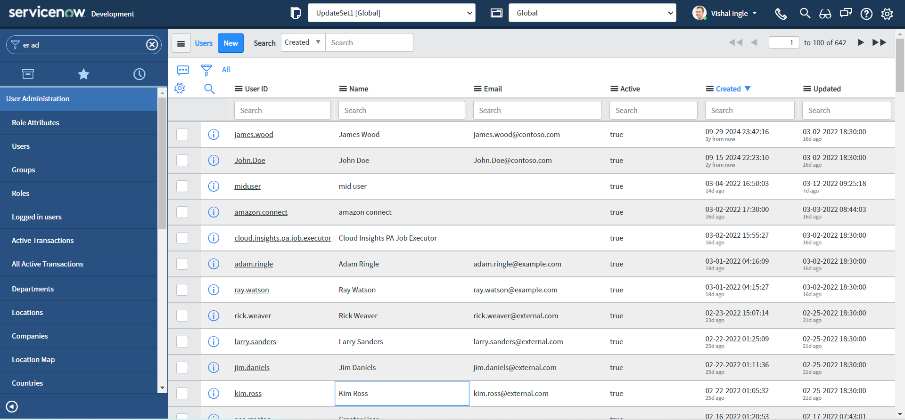
- Click **New** and enter the following information:

  - **User ID:** FirstIntegrationUser
  - **Password:** FirstIntegrationUserPassword
  - **First name:** First
  - **Last name:** IntegrationUser

  

- Select this check box for **Web service access only** to designate this user as a non-interactive user & Click **Submit**.

  

- Now we need to give the service account user any roles necessary to perform the actions that will be carried out by the integration. Navigate to **User Administration > Users** and then open our recently created Service Account user record **"FirstIntegrationUser"**.
  
  

- In the Roles related list, click **Edit**.
  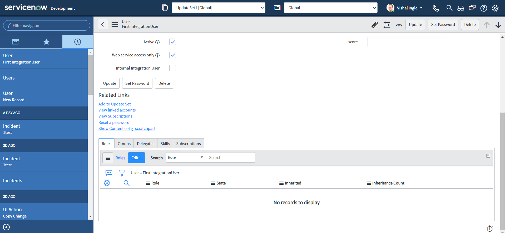

- In the Collection list, select the desired roles (for our purpose we will use **itil** role), and then click **Add**.
  

- Click **Save**.
  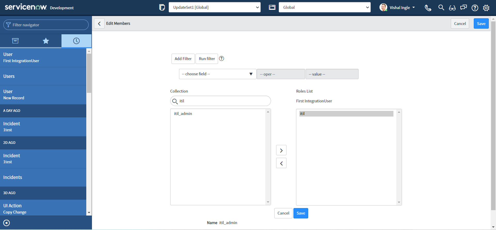

&nbsp;&nbsp;&nbsp;&nbsp;Now let us modify our script to have Service account's credentials :

```js
var request = new sn_ws.RESTMessageV2()
request.setEndpoint("https://dev124645.service-now.com/api/now/table/incident")
request.setHttpMethod("POST")

//Eg. UserName="admin", Password="admin" for this code sample.
var user = "FirstIntegrationUser"
var password = "FirstIntegrationUserPassword"

request.setBasicAuth(user, password)
request.setRequestHeader("Accept", "application/json")
request.setRequestHeader("Content-Type", "application/json")
request.setRequestBody(
  '{"short_description":"Test SD","description":"Test Desc","assignment_group":"0a52d3dcd7011200f2d224837e6103f2","impact":"2","urgency":"1","state":"3","hold_reason":"4","category":"inquiry","contact_type":"email"}'
)
var response = request.execute()
gs.log(response.getBody())
```

&nbsp;&nbsp;&nbsp;&nbsp;And if we re-execute the script in **System Definition > Scripts - Background** with new credentials, you will get the output as below, which indicates that our snippet still works:

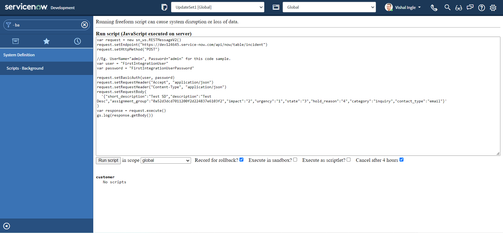


&nbsp;&nbsp;&nbsp;&nbsp;Here, we did not see in detail about creating a user or assigning a role to a user. But if you want to dig deep, ServiceNow documentation is the best place to start with and has all that you need, right [here](https://docs.servicenow.com/bundle/sandiego-platform-administration/page/administer/users-and-groups/task/t_CreateAUser.html) and [here](https://docs.servicenow.com/bundle/sandiego-platform-administration/page/administer/users-and-groups/task/t_AssignARoleToAUser.html). Also OOTB any one of itil, sn_incident_write or admin role is required to create an incident. You can read more about incident creation [here](https://docs.servicenow.com/bundle/sandiego-it-service-management/page/product/incident-management/task/create-an-incident.html)

### Additional Contact Type : API

&nbsp;&nbsp;&nbsp;&nbsp;OOTB, we do not have the contact type as "API" on our Personal Developer Instance (PDI), Let us create one:


- Navigate to **Incident > Open** in a new tab, Click any incident number to open the incident form:
  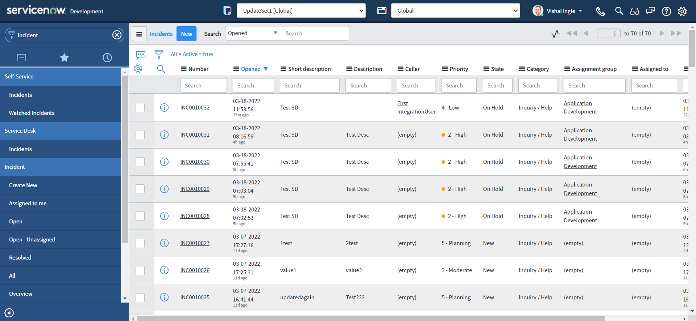
  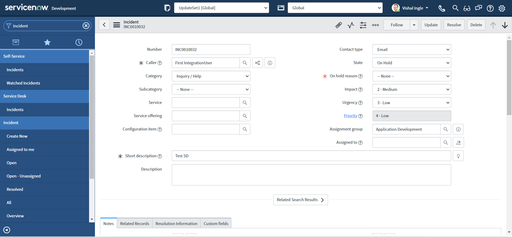
- Right-click the **Contact type** field label and select **Configure Choices**. The Configuring State Choices slushbucket will open.
  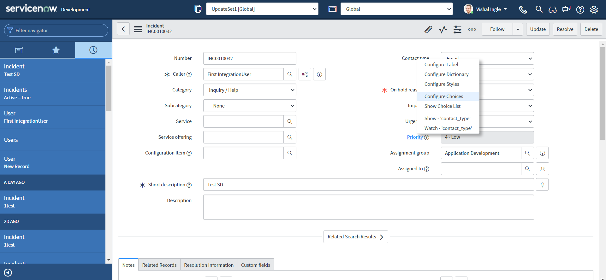
  

- In **Enter new item:** field type **API** and click **Add**.
  
- Click **Save**.
  

&nbsp;&nbsp;&nbsp;&nbsp;If we did everything correctly, we should have and additional contact type now named "API":
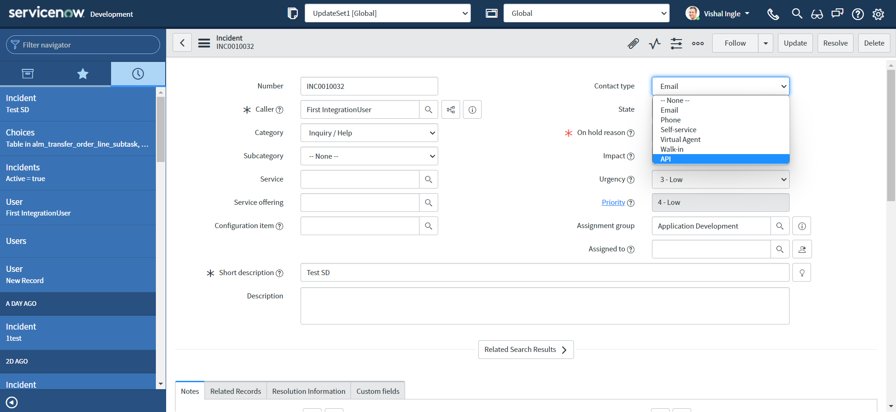

### Assignment group

&nbsp;&nbsp;&nbsp;&nbsp;Finally, let us create one assignment group to be assigned to the incident created by means of our integration:

- Navigate to **User Administration > Groups** and click **New** button:
  

- Create a group with Name as "FirstIntegrationGroup", Type as "itil" & Parent as "Incident Management" and click **Submit** button:
  

## Setting up the Vendor Instance

&nbsp;&nbsp;&nbsp;&nbsp;We have everything that we need from our customer instance set up, but we still need to set our Vendor instance. I have borrowed another PDI from one of my friend to use as Vendor instance, and we are ready fix the prerequisites. However, The San Diego Release of ServiceNow comes with a brand new interface known as the Next Experience UI, or also internally known as Polaris, So you might experience a different look and feel on our Vendor instance. In a way it is good for us as we will be able to easily identify which is our Customer instance (UI16) or Vendor instance (Plaris).

### Assignment group

&nbsp;&nbsp;&nbsp;&nbsp;Like our customer instance we need an assignment group to be created on Vendor instance to be used as a trigger to the APIs, Let us create one:

- Navigate to **User Administration > Groups** and click **New** button:
  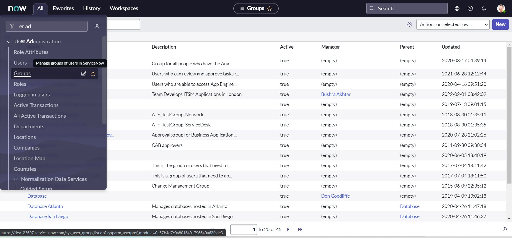
  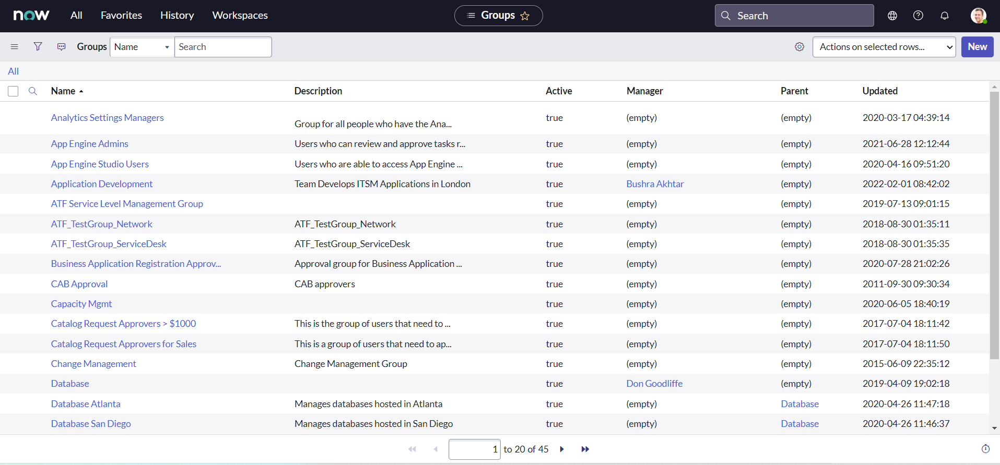

- Create a group with Name as "VendorAssignmentGroup", Type as "itil" & Parent as "Incident Management" and click **Submit** button:
  

### Additional On hold reason : Awaiting Company A Validation

&nbsp;&nbsp;&nbsp;&nbsp;OOTB, we do not have the On hold reason choice as "Awaiting Company A Validation" on our Vendor PDI, Let us create one:
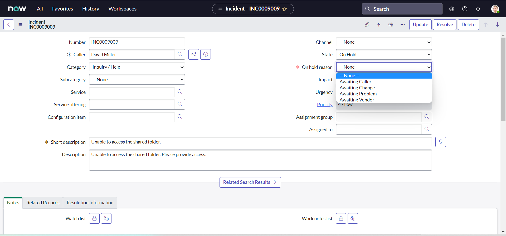

- Navigate to **Incident > Open** in a new tab, Click any incident number to open the incident form:
  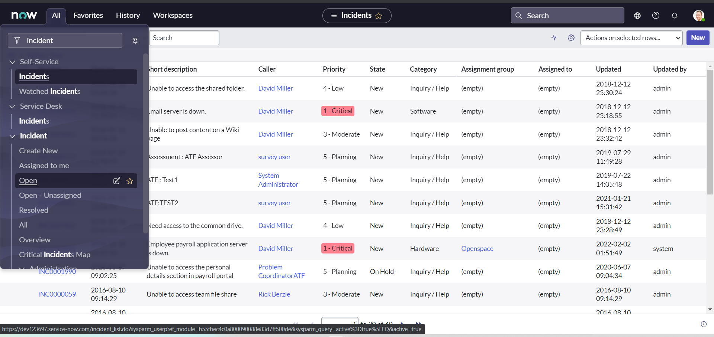
  
  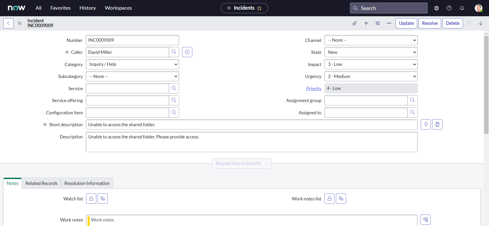
- Right-click the **On hold reason** field label and select **Configure Choices**. The Configuring State Choices slushbucket will open.
  
  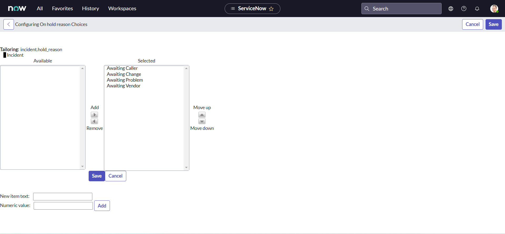

- In **Enter new item:** field type **Awaiting Company A Validation** and click **Add**.
  
- Click **Save**.
  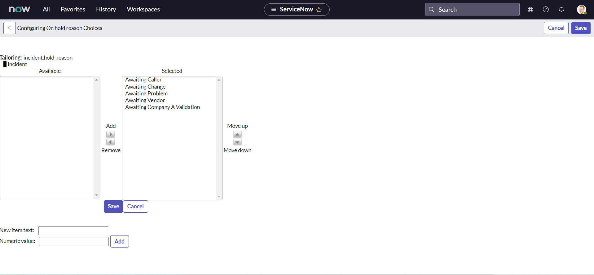

&nbsp;&nbsp;&nbsp;&nbsp;If we did everything correctly, we should have and additional On hold reason choice as "Awaiting Company A Validation":
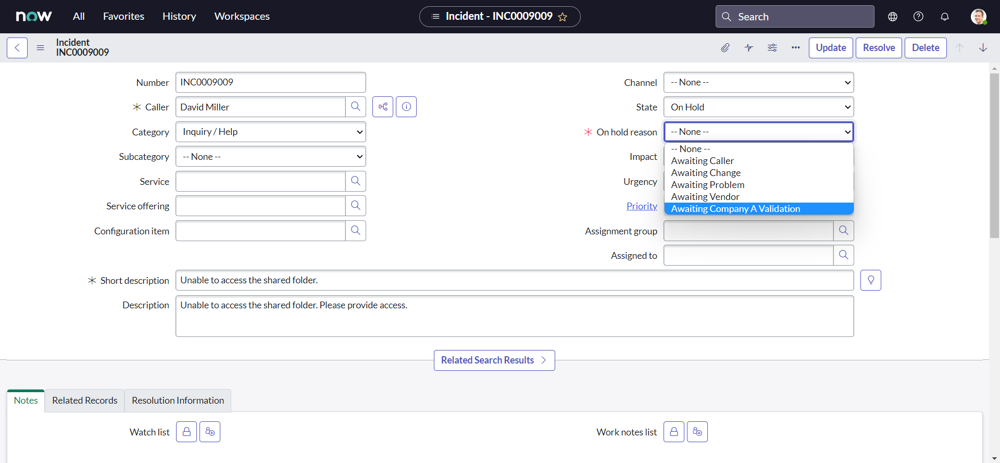

### Service & Service Offering

&nbsp;&nbsp;&nbsp;&nbsp;Like assignment group, we also need an Service created on Vendor instance to be used as a trigger to the APIs. In addition we also need a Service offering of which information we will map to the description:

- Navigate to **All > Service Portfolio Management > Business Services** and click the **New** button:
  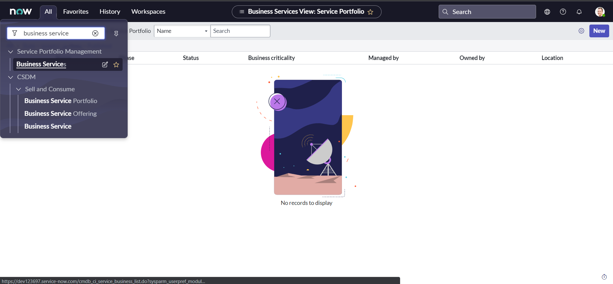
  

- Set the **Name** as **"IntegrateNow"** and click the **Submit** button:
  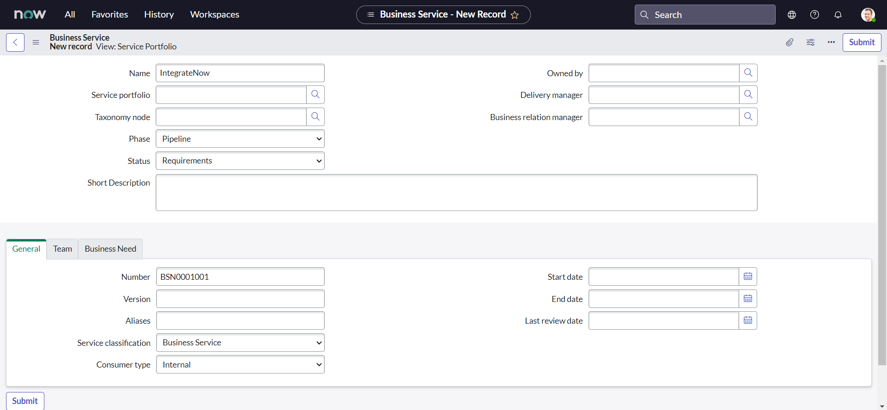

- A new Service named **"IntegrateNow"** should be created. Click on the name to open the record:
  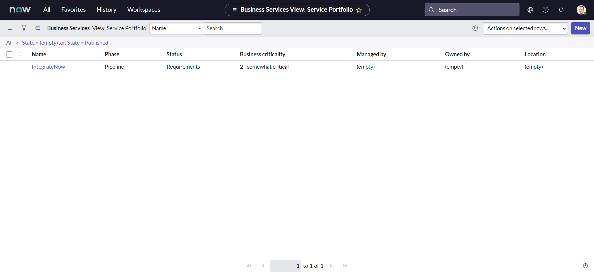

- Scroll to the bottom of the form to find the related list **Offering** , then click **New** to create a new service offering:
  

- Set the **Name** as **"IntegrateNow Support"** and click the **Submit** button:
  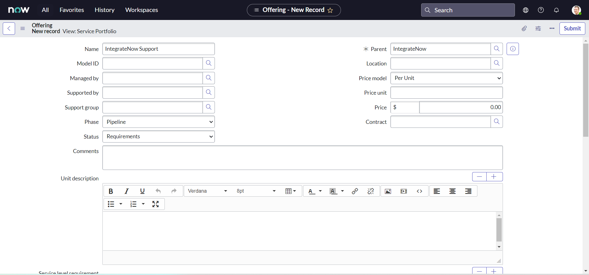

- A new Service offering named **"IntegrateNow Support"** should be created:
  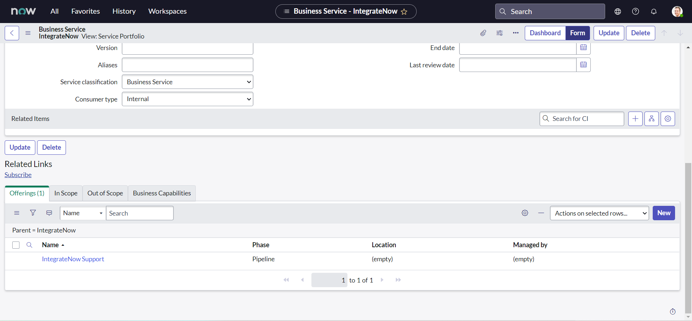

## Integration time

&nbsp;&nbsp;&nbsp;&nbsp;Till this point, we have all the pre-requisites fulfilled for our integration, and now we are ready to implement our integration. There are different ways of achieving this use case, but we are going to start with the most traditional approach of script. In coming chapters we will enhance our approach to be more efficient. So without furthur due, let us start with the last section of this chapter.

### Business Rule

&nbsp;&nbsp;&nbsp;&nbsp;Here, we will create a business rule on our Vendor instance that will trigger the API if our condition matches and creates the incident on customer instance.

- Navigate to **All > System Definition > Business Rules**.
  
- Click **New**.
  
- Enter any **Name** for the business rule.
  
- Select the **Table** that the business rule runs on i.e. **Incident [incident]**.
  
- Select the **Advanced** check box to see the advanced version of the form.
  
- For **When** field select **after**.
  
- Select the **Insert** check box to execute the business rule when a record is inserted into the database.
  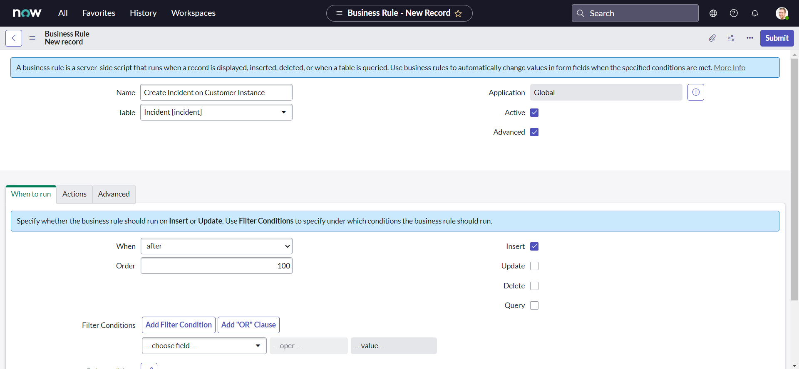
- Now, copy and paste our modified code sample into the **Script** field & click **Submit**.
  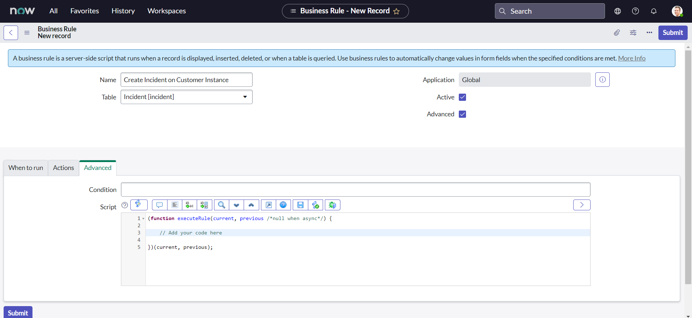
  

&nbsp;&nbsp;&nbsp;&nbsp;The final script in the business rule script field should look something like this :

```js
;(function executeRule(current, previous /*null when async*/) {
  // Add your code here
  var request = new sn_ws.RESTMessageV2()
  request.setEndpoint(
    "https://dev124645.service-now.com/api/now/table/incident"
  )
  request.setHttpMethod("POST")

  //Eg. UserName="admin", Password="admin" for this code sample.
  var user = "FirstIntegrationUser"
  var password = "FirstIntegrationUserPassword"

  request.setBasicAuth(user, password)
  request.setRequestHeader("Accept", "application/json")
  request.setRequestHeader("Content-Type", "application/json")
  request.setRequestBody(
    '{"short_description":"Test SD","description":"Test Desc","assignment_group":"0a52d3dcd7011200f2d224837e6103f2","impact":"2","urgency":"1","state":"3","hold_reason":"4","category":"inquiry","contact_type":"email"}'
  )
  var response = request.execute()
  gs.log(response.getBody())
})(current, previous)
```

- Finally, set the **Filter Conditions** as shown in below image & click **Update**:
  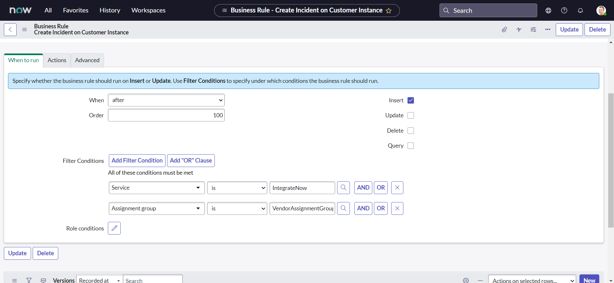

&nbsp;&nbsp;&nbsp;&nbsp;Believe it or not, we can even test our integration now. Though our values are still static. If you are curious why did we set the fields the way we do, please refer the ServiceNow documentation [here](https://docs.servicenow.com/bundle/sandiego-application-development/page/script/business-rules/reference/r_HowBusinessRulesWork.html).

- On Vendor instance, Navigate to **All > Incident > Create New**:
  
- Set the Service as **IntegrateNow** & Assignment group as **VendorAssignmentGroup**:
  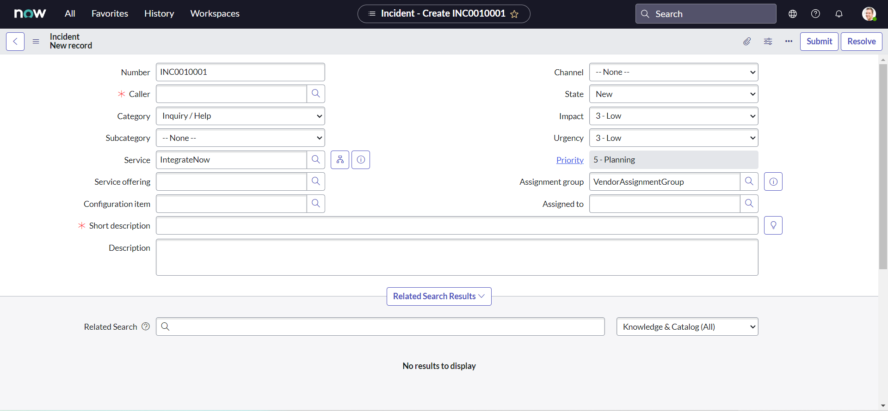
- Fill all other mandatory fields with the values you may like & click **Submit**:
  
- We can notice from the recent system logs, that our API has successfully been triggered:
  
- On Customer instance, we can validate that new incident has been created:
  

## We are not done yet

&nbsp;&nbsp;&nbsp;&nbsp;To be honest, I did not expect this chapter to be this long. We did lot of stuff and I would like to give yourself some time to digest all of these. In the next chapter, we will resume from where we stopped today and will complete our first integration.

---

## What's next?

&nbsp;&nbsp;&nbsp;&nbsp; In the next chapter, we will resume from where we stopped today and will complete our first integration.We will point out some of the concerns with this traditional approach and start the quest for better solutions.
