## Chapter 5

# Finishing Touches

## Where did we stop

&nbsp;&nbsp;&nbsp;&nbsp;Last time, we did set up both of our Customer and Vendor instances to make them ready for our use case; We did leverage the REST API Explorer to generate a sample script with some dummy data and used it in Business Rule to create an incident on our Customer instance from a Vendor instance. This is a unique use case where we actually did leverage outbound (triggering the API from Vendor instance) and inbound (providing the inbound API and responding to API request by creating an incident on Customer instance). This difference will be more clear as we proceed with our series and implement some of the awesome use cases. For now let us start from where we did leave last time and finish our first integration.

&nbsp;&nbsp;&nbsp;&nbsp;The final script that we did put in our business rule script field should look something like this :

```js
;(function executeRule(current, previous /*null when async*/) {
  // Add your code here
  var request = new sn_ws.RESTMessageV2()
  request.setEndpoint(
    "https://dev124645.service-now.com/api/now/table/incident"
  )
  request.setHttpMethod("POST")

  //Eg. UserName="admin", Password="admin" for this code sample.
  var user = "FirstIntegrationUser"
  var password = "FirstIntegrationUserPassword"

  request.setBasicAuth(user, password)
  request.setRequestHeader("Accept", "application/json")
  request.setRequestHeader("Content-Type", "application/json")
  request.setRequestBody(
    '{"short_description":"Test SD","description":"Test Desc","assignment_group":"0a52d3dcd7011200f2d224837e6103f2","impact":"2","urgency":"1","state":"3","hold_reason":"4","category":"inquiry","contact_type":"email"}'
  )
  var response = request.execute()
  gs.log(response.getBody())
})(current, previous)
```

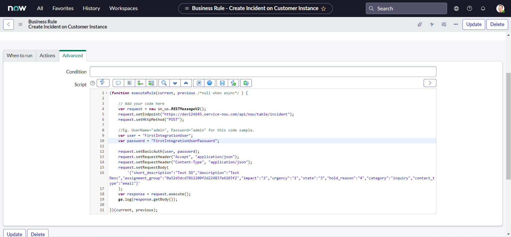

&nbsp;&nbsp;&nbsp;&nbsp;As we did test last time, the script works as is but it has some issues that needs to be tackeled. Let us point them out and fix one by one.

## What is not right

### Statics request body

&nbsp;&nbsp;&nbsp;&nbsp;The very first thing that we should fix is the request body or data that we will pass to the server. It is static meaning it will always create an incident with same information. We want it to be dynamic and it should fetch the information from the incident for which the Business Rule is triggered. Notice the following line from the above script :

```js
request.setRequestBody(
  '{"short_description":"Test SD","description":"Test Desc","assignment_group":"0a52d3dcd7011200f2d224837e6103f2","impact":"2","urgency":"1","state":"3","hold_reason":"4","category":"inquiry","contact_type":"email"}'
)
```

&nbsp;&nbsp;&nbsp;&nbsp; **setRequestBody()** method accepts one string parameter as the body content to send to the web service provider when using PUT or POST HTTP methods. In above example, we are passing a static json string as a parameter value. Which means we can rewrite above line of code as below:

```js
var reqBody = {
  short_description: "Test SD",
  description: "Test Desc",
  assignment_group: "0a52d3dcd7011200f2d224837e6103f2",
  impact: "2",
  urgency: "1",
  state: "3",
  hold_reason: "4",
  category: "inquiry",
  contact_type: "email",
}
request.setRequestBody(JSON.stringify(reqBody))
```

&nbsp;&nbsp;&nbsp;&nbsp; What we did here is storing the content of our request body as an json object and then convert it to string right before passing it to the server. If you are not aware of how this works, you have probably skipped [Chapter 2](/Chapter2_WhatYouNeedToKnowAboutJSONAndObjects.md), where we did talk a lot about json and I encourage you to go back and get familier with it. Now let us use the current argument of Business rule to fetch the values from current incident dynamically:

```js
var reqBody = {
  short_description: current.getDisplayValue("short_description"),
  impact: current.getValue("impact"),
  urgency: current.getValue("urgency"),
  state: current.getValue("state"),
}
request.setRequestBody(JSON.stringify(reqBody))
```

&nbsp;&nbsp;&nbsp;&nbsp; Here, I have removed the other properties from the object on purpose. We will add them back to the object after we perform some manipulation on the information. Why? Remember the tweaks that we need to consider; it is necessary to write a clean code to not make it unnecessarily un-readable. Let us tackle each of this tweaks:

#### Tweak 1 :

&nbsp;&nbsp;&nbsp;&nbsp;Our Vendor (Company A) instance has an additional On hold reason choice "Awaiting Company A Validation" (for some internal validation). Whereas our Customer (Company B) instance has all Out of the box (OOTB) choices. So, we need to map our custom choice "Awaiting Company A Validation" from the Vendor instance to the "Awaiting Vendor" on the Customer i.e. Company B instance.

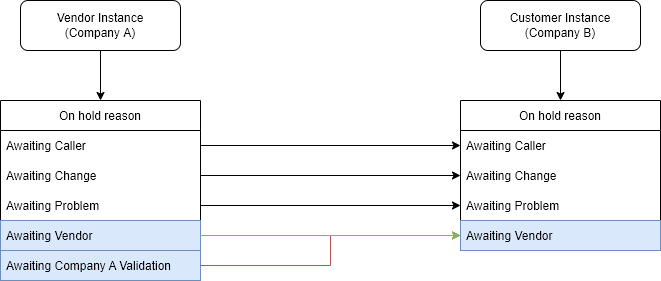

&nbsp;&nbsp;&nbsp;&nbsp;To implement this, We could rewrite our line of code as below :

```js
var reqBody = {
  short_description: current.getDisplayValue("short_description"),
  impact: current.getValue("impact"),
  urgency: current.getValue("urgency"),
  state: current.getValue("state"),
}
if (current.getValue("state") == "3") {
  //if State is On Hold
  var onHoldReason = current.getValue("hold_reason")
  if (onHoldReason == "6") {
    //if Awaiting Company A Validation
    onHoldReason = "4" //set to Awaiting Vendor
  }
  reqBody["hold_reason"] = onHoldReason //add the property to object reqBody
}
request.setRequestBody(JSON.stringify(reqBody))
```

#### Tweak 2 :

&nbsp;&nbsp;&nbsp;&nbsp;We have an additional Contact type "API" on Customer instance and no matter through which channel the incident is created on Vendor instance, the target incident on Customer instance should have the Contact type set as "API".

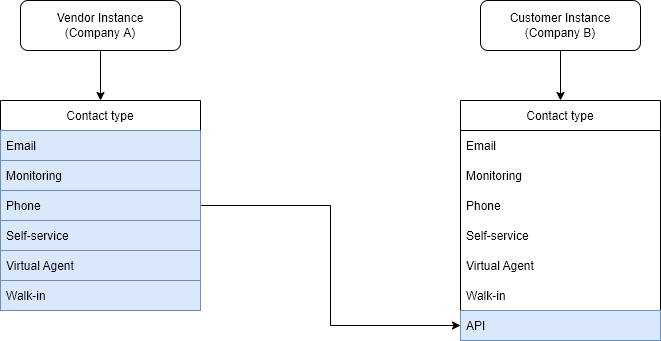

&nbsp;&nbsp;&nbsp;&nbsp;We also have the requirement to always map the incident to the "Inquiry / Help" category on Customer instance:

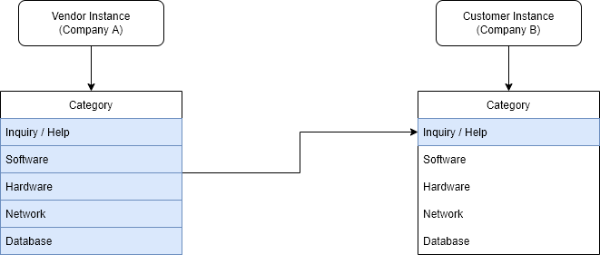

&nbsp;&nbsp;&nbsp;&nbsp;Since, we always need the static values for contact type and category values, we can leverage the system properties to modify our code as below :

```js
var reqBody = {
  short_description: current.getDisplayValue("short_description"),
  impact: current.getValue("impact"),
  urgency: current.getValue("urgency"),
  state: current.getValue("state"),
}
if (current.getValue("state") == "3") {
  //if State is On Hold
  var onHoldReason = current.getValue("hold_reason")
  if (onHoldReason == "6") {
    //if Awaiting Company A Validation
    onHoldReason = "4" //set to Awaiting Vendor
  }
  reqBody["hold_reason"] = onHoldReason //add the property to object reqBody
}
reqBody["contact_type"] = gs.getProperty("integratenow.customer.contact_type") //set Contact Type as API
reqBody["category"] = gs.getProperty("integratenow.customer.category") //set Category as Inquiry / Help
reqBody["assignment_group"] = gs.getProperty(
  "integratenow.customer.assignment_group"
) //set target/customer Assignment group (FirstIntegrationGroup)
request.setRequestBody(JSON.stringify(reqBody))
```

&nbsp;&nbsp;&nbsp;&nbsp;Here, I've also set the target assignment group which is predefined by business. But none of these system properties are defined yet, so we need to create them :

- In the Navigation filter, type **sys_properties.list** and click enter
  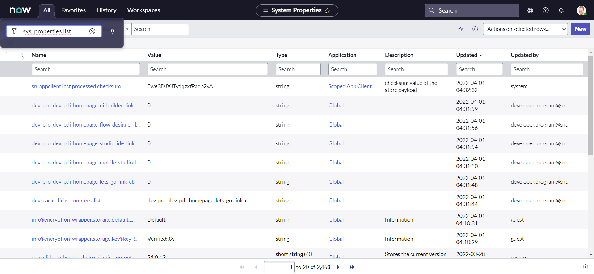
- Click **New**
  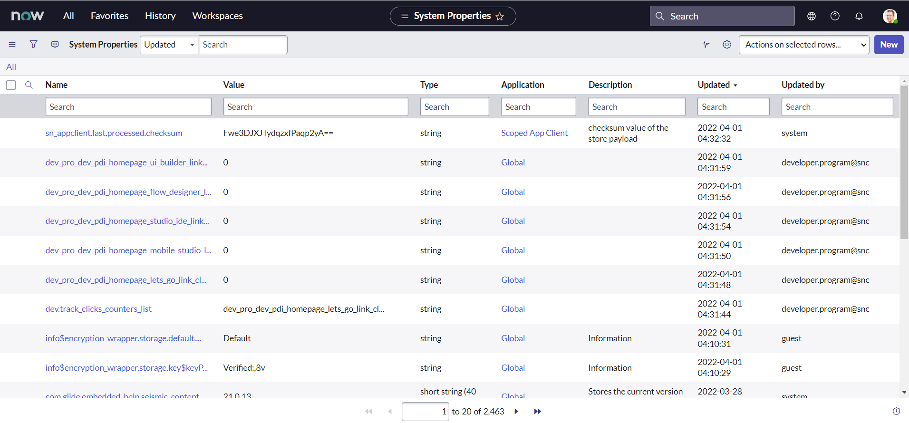
- Name the property as **integratenow.customer.contact_type**
  
- Set the desired string value for field Value as **API** & click submit.
  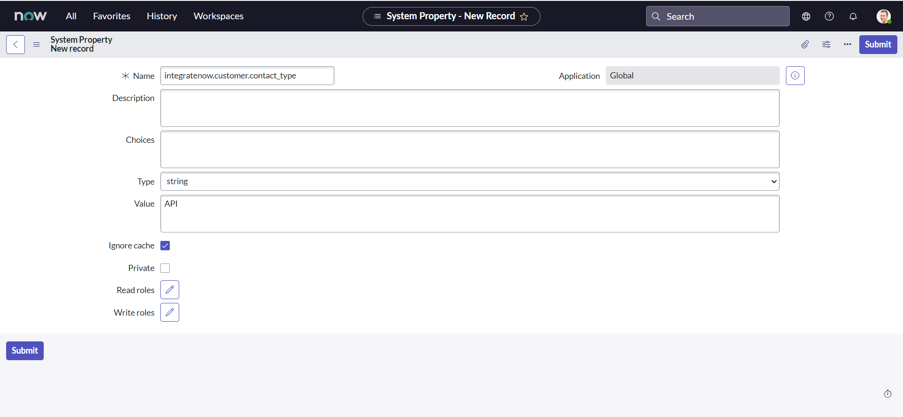
- Create two more properties as below:
  - Name : **integratenow.customer.category**, Value : **inquiry**
  - Name : **integratenow.customer.assignment_group**, Value : **a12fc27d87da491028720d47dabb35d9**
    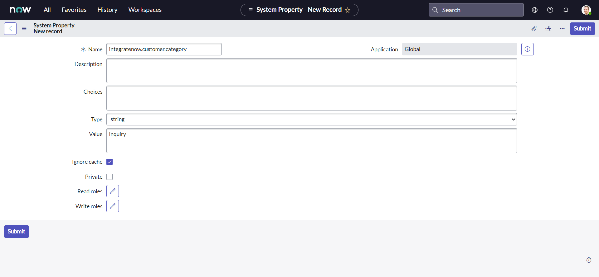
    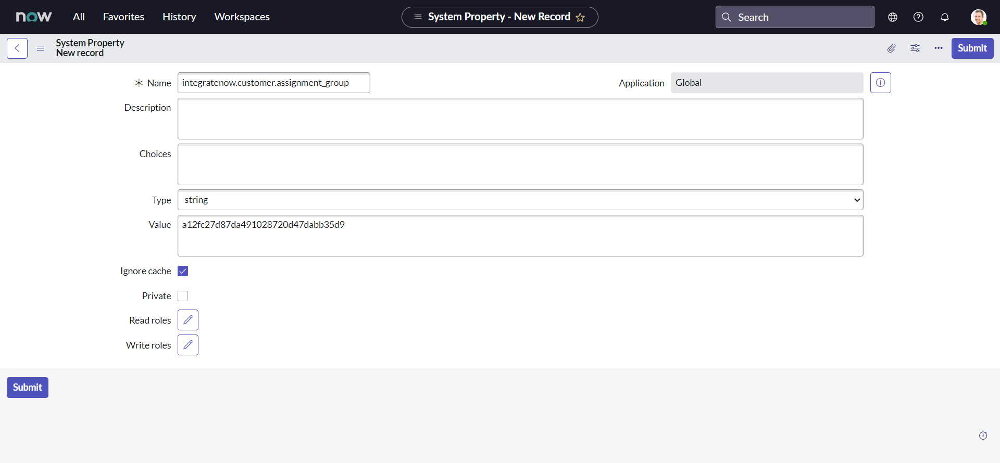
    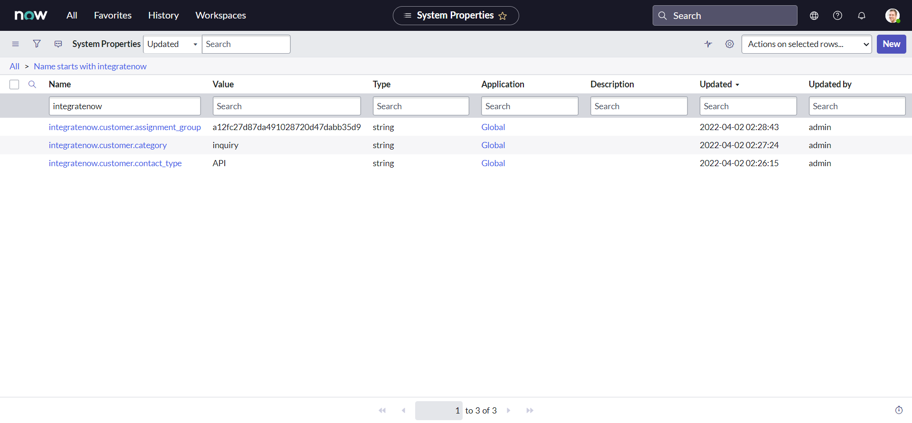

&nbsp;&nbsp;&nbsp;&nbsp;A point to remember here (and going forward), all the custom values for the records that we did create, including group sys_id might be different for you. So be cautious!

#### Tweak 3 :

&nbsp;&nbsp;&nbsp;&nbsp;And the last tweak that we need to tackle is that the Service, Service Offering and the Description needs to be mapped with to Description field:


&nbsp;&nbsp;&nbsp;&nbsp;Let us rewrite our line of code to accomodate this requirement:

```js
var reqBody = {
  short_description: current.getDisplayValue("short_description"),
  impact: current.getValue("impact"),
  urgency: current.getValue("urgency"),
  state: current.getValue("state"),
}
if (current.getValue("state") == "3") {
  //if State is On Hold
  var onHoldReason = current.getValue("hold_reason")
  if (onHoldReason == "6") {
    //if Awaiting Company A Validation
    onHoldReason = "4" //set to Awaiting Vendor
  }
  reqBody["hold_reason"] = onHoldReason //add the property to object reqBody
}
reqBody["contact_type"] = gs.getProperty("integratenow.customer.contact_type") //set Contact Type as API
reqBody["category"] = gs.getProperty("integratenow.customer.category") //set Category as Inquiry / Help
reqBody["assignment_group"] = gs.getProperty(
  "integratenow.customer.assignment_group"
) //set target/customer Assignment group (FirstIntegrationGroup)
var newDescription =
  "Service: " +
  current.getDisplayValue("business_service") +
  "\n" +
  "Service Offering: " +
  current.getDisplayValue("service_offering") +
  "\n" +
  "Description: " +
  current.getDisplayValue("description")
reqBody["description"] = newDescription.toString()
request.setRequestBody(JSON.stringify(reqBody))
```

&nbsp;&nbsp;&nbsp;&nbsp;Here, we did assume that All the fields will have some value, but you are free to modify and make it more fail safe.

### Exposed credentials

&nbsp;&nbsp;&nbsp;&nbsp;As you can notice from the following lines from the our script, we are exposing our username and password directly in the script. This is not a best practice and there are better way of implementing the integration that we will see later in this series. For now we are just going to ignore it to save some time, but you could probably write additional system properties to store them.

```js
var user = "FirstIntegrationUser"
var password = "FirstIntegrationUserPassword"
```

### Static endpoints

&nbsp;&nbsp;&nbsp;&nbsp;Observe the below line of code :

```js
request.setEndpoint("https://dev124645.service-now.com/api/now/table/incident")
```

&nbsp;&nbsp;&nbsp;&nbsp;**setEndpoint()** method sets the endpoint for the REST message. It accepts one parameter which is the URL of the REST provider you want to interface with, or in other words, endpoint. E.g. in our code we set the endpoint to `https://dev124645.service-now.com/api/now/table/incident`. The problem with this approach is our endpoint is now static and for any reason if the endpoint changes, we need to change it in every possible script it is used. Again, we are not going to fix it right away. You can utilize the system properties to tackle this problem as well, but this can be handled in a better way that we will see in later chapters.

&nbsp;&nbsp;&nbsp;&nbsp;Our modified Business Rule script should now look something like this :

```js
;(function executeRule(current, previous /*null when async*/) {
  // Add your code here
  var request = new sn_ws.RESTMessageV2()
  request.setEndpoint(
    "https://dev124645.service-now.com/api/now/table/incident"
  )
  request.setHttpMethod("POST")

  //Eg. UserName="admin", Password="admin" for this code sample.
  var user = "FirstIntegrationUser"
  var password = "FirstIntegrationUserPassword"

  request.setBasicAuth(user, password)
  request.setRequestHeader("Accept", "application/json")
  request.setRequestHeader("Content-Type", "application/json")
  var reqBody = {
    short_description: current.getDisplayValue("short_description"),
    impact: current.getValue("impact"),
    urgency: current.getValue("urgency"),
    state: current.getValue("state"),
  }

  if (current.getValue("state") == "3") {
    //if State is On Hold
    var onHoldReason = current.getValue("hold_reason")
    if (onHoldReason == "6") {
      //if Awaiting Company A Validation
      onHoldReason = "4" //set to Awaiting Vendor
    }
    reqBody["hold_reason"] = onHoldReason //add the property to object reqBody
  }

  reqBody["contact_type"] = gs.getProperty("integratenow.customer.contact_type") //set Contact Type as API
  reqBody["category"] = gs.getProperty("integratenow.customer.category") //set Category as Inquiry / Help
  reqBody["assignment_group"] = gs.getProperty(
    "integratenow.customer.assignment_group"
  ) //set target/customer Assignment group (FirstIntegrationGroup)

  var newDescription =
    "Service: " +
    current.getDisplayValue("business_service") +
    "\n" +
    "Service Offering: " +
    current.getDisplayValue("service_offering") +
    "\n" +
    "Description: " +
    current.getDisplayValue("description")
  reqBody["description"] = newDescription.toString()

  request.setRequestBody(JSON.stringify(reqBody))
  var response = request.execute()
  gs.log(response.getBody())
})(current, previous)
```

&nbsp;&nbsp;&nbsp;&nbsp;We have almost completed our first integration and we can perform a test before we do furthur modifications.

- On Vendor instance, Navigate to **All > Incident > Create New**:
  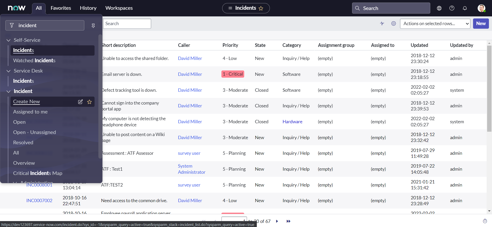
- Set the Service as **IntegrateNow** & Assignment group as **VendorAssignmentGroup**:
  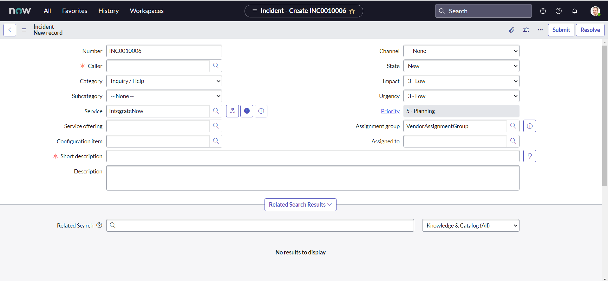
- Fill all other desired fields with the values you may like & click **Submit**:
  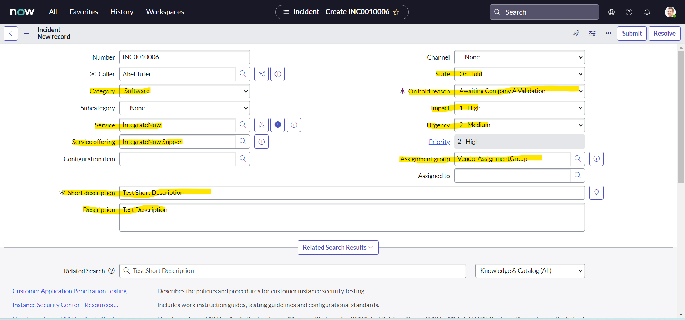
- We can notice from the recent system logs, that our API has successfully been triggered:
  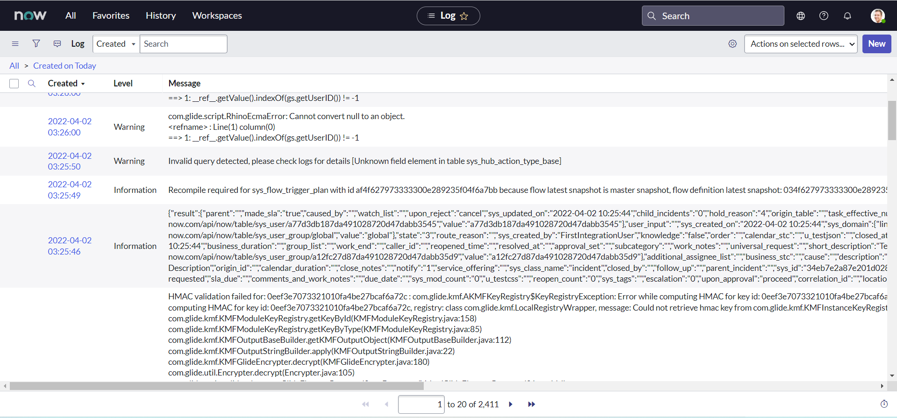
- On Customer instance, we can validate that new incident has been created:
  
  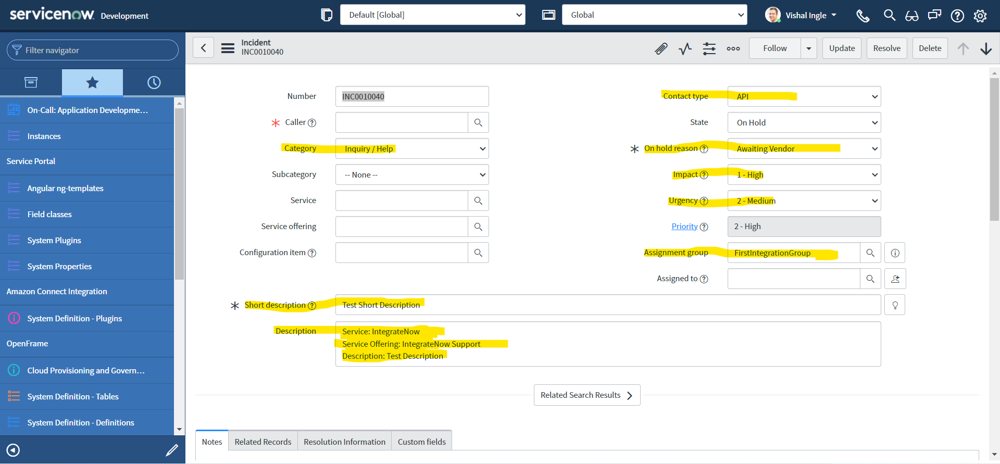

## Correlation

&nbsp;&nbsp;&nbsp;&nbsp;Okay, technically we did implement our first use case, but it is not enough. What do I mean? Think of the functional side, How would you know on Customer end that the incident exists in their table corresponds to which incident on Vendor instance? If there are multiple other tools that are generating the incidents using same Service Account then how would you know it corresponds to which tool? Most importantly, If we want to update an incident whenever the incident is updated on either end, how would you know which incident to update? In worst case you might create multiple duplicate incidents for one vendor incident and you need something to prevent that behavior. Seems like a big issue, well how would you tackle this problem? The answer is **Correlation**.

&nbsp;&nbsp;&nbsp;&nbsp;**A correlation establishes a synchronization relationship between records that reside on separate instances.** The **Correlation ID** identifies the remote record whose data values should be used to update the local record. For example, suppose incident record INC100001 correlates to problem record PRB123456 on a remote instance. Whenever changes are made to fields in remote problem PRB123456, the system uses the Correlation ID to identify that local incident INC100001 receives the same field updates.

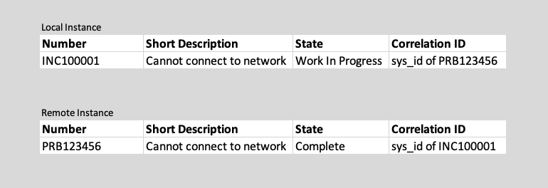

&nbsp;&nbsp;&nbsp;&nbsp;If you have wondered what Correlation ID and Correlation Display fields are for or if you need better explaination, Please do read an post on **SN Guru Blog**, which can be found [here](https://servicenowguru.com/integration/correlation-id-display-fields/). But, I would also like to quote a shorter answer from **john andersen** to the community post which can be found [here](https://community.servicenow.com/community?id=community_question&sys_id=d44d4ba9db9cdbc01dcaf3231f9619fe) as is :

> These fields are typically used for Integration purposes. You will often store a corresponding third party record ID in the correlation ID field. The correlation Display field can contain a free-form descriptive label of what third party system is replicating or tied to this record.\
> For example, if you are tying incident records to a third party ticketing system when they are created within ServiceNow, the corresponding ticket ID from the third party would be stored in the correlation ID field. You could also set the correlation display field to be "JIRA", or "REMEDY", or whatever you want to indicate the third party system using this ticket.

&nbsp;&nbsp;&nbsp;&nbsp;ServiceNow documentaion article on Correlation is also a good read which can be found [here](https://docs.servicenow.com/bundle/rome-servicenow-platform/page/administer/integrationhub/concept/correlation.html).

## Filling the gaps

&nbsp;&nbsp;&nbsp;&nbsp;In our script we are using the following line as our last line of code, which just logs the returned response to the log table :

```js
gs.log(response.getBody())
```

&nbsp;&nbsp;&nbsp;&nbsp;**getBody()** method gets the content of the REST response body as text. E.g. In our case, we did recieve the response back as json string. We can replace this line by following code which converts the json string to json object and then gets the required fields from the json object to be used to store in Correlation fields :

```js
var resBody = JSON.parse(response.getBody())
current.setValue("correlation_id", resBody["result"]["number"])
current.setValue("correlation_display", "CustomerIncNumber")
current.work_notes = JSON.stringify(resBody)
```

&nbsp;&nbsp;&nbsp;&nbsp;Here, It is important to notice that we are not using setter method for worknotes, as the setValue() method is not supported for journal fields and documented [here](https://docs.servicenow.com/bundle/sandiego-platform-administration/page/administer/field-administration/concept/c_JournalFields.html). Many times I did use the getValue() or setValue() method to with additional comments or work notes and found myself spend a lot of time debugging it. It is very well expained by **Tim Woodruff** in his **ServiceNow Development Handbook - Third Edition** book, which is a must read if you want some awesome pro tips and thank yourself later.

&nbsp;&nbsp;&nbsp;&nbsp;As long as our code is concerned, we are parsing the Incident "Number" of Incident created on customer instance by our API and storing it in a field "Correlation ID". We also did store the Correlation Display as a static string "CustomerIncNumber" to indicate it represents the Incident number of the customer instance. In the last line I'm just adding the whole response from the API to the activity streams, You would not do it in real time unless there is a use case.

&nbsp;&nbsp;&nbsp;&nbsp;Similar to the above, we also need to store the Correlation ID and Correlation Display fields on customer instance with the current incident number and some identifier text. Let us modify our code one last time to include the following lines to it :

```js
reqBody["correlation_id"] = current.getDisplayValue("number")
reqBody["correlation_display"] = "VendorIncNumber"
```

&nbsp;&nbsp;&nbsp;&nbsp;Our final Business Rule script should look something like this now:

```js
;(function executeRule(current, previous /*null when async*/) {
  // Add your code here
  var request = new sn_ws.RESTMessageV2()
  request.setEndpoint(
    "https://dev124645.service-now.com/api/now/table/incident"
  )
  request.setHttpMethod("POST")

  //Eg. UserName="admin", Password="admin" for this code sample.
  var user = "FirstIntegrationUser"
  var password = "FirstIntegrationUserPassword"

  request.setBasicAuth(user, password)
  request.setRequestHeader("Accept", "application/json")
  request.setRequestHeader("Content-Type", "application/json")
  var reqBody = {
    short_description: current.getDisplayValue("short_description"),
    impact: current.getValue("impact"),
    urgency: current.getValue("urgency"),
    state: current.getValue("state"),
  }

  if (current.getValue("state") == "3") {
    //if State is On Hold
    var onHoldReason = current.getValue("hold_reason")
    if (onHoldReason == "6") {
      //if Awaiting Company A Validation
      onHoldReason = "4" //set to Awaiting Vendor
    }
    reqBody["hold_reason"] = onHoldReason //add the property to object reqBody
  }

  reqBody["contact_type"] = gs.getProperty("integratenow.customer.contact_type") //set Contact Type as API
  reqBody["category"] = gs.getProperty("integratenow.customer.category") //set Category as Inquiry / Help
  reqBody["assignment_group"] = gs.getProperty(
    "integratenow.customer.assignment_group"
  ) //set target/customer Assignment group (FirstIntegrationGroup)

  var newDescription =
    "Service: " +
    current.getDisplayValue("business_service") +
    "\n" +
    "Service Offering: " +
    current.getDisplayValue("service_offering") +
    "\n" +
    "Description: " +
    current.getDisplayValue("description")
  reqBody["description"] = newDescription.toString()

  reqBody["correlation_id"] = current.getDisplayValue("number")
  reqBody["correlation_display"] = "VendorIncNumber"
  request.setRequestBody(JSON.stringify(reqBody))
  var response = request.execute()
  var resBody = JSON.parse(response.getBody())
  current.setValue("correlation_id", resBody["result"]["number"])
  current.setValue("correlation_display", "CustomerIncNumber")
  current.work_notes = JSON.stringify(resBody)
})(current, previous)
```

&nbsp;&nbsp;&nbsp;&nbsp; Finally, Since we should not use current.update() in our script, let us change the Business Rule trigger condition as below:

- When : **before**
- Insert : **Checked**
- Update : **Checked**
- Filter Conditions :
  - Service is IntegrateNow
  - Assignment group is VendorAssignmentGroup
  - Correlation ID is empty
  - Correlation Display is empty

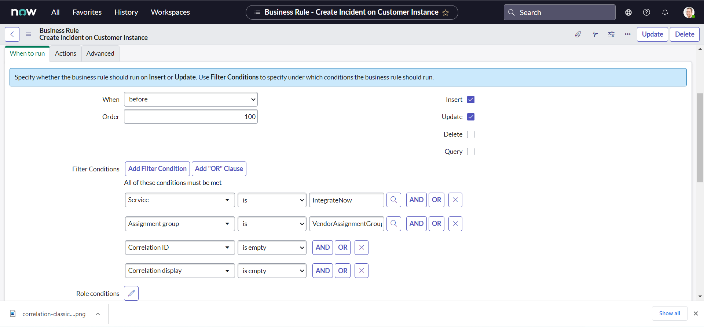

## Final testing

&nbsp;&nbsp;&nbsp;&nbsp;So, we have finally arrived at the point for which we did wait so long. We did complete our first integration and it is time to test it.

- On Vendor instance, Navigate to **All > Incident > Create New**:
  
- Set the Service as **IntegrateNow** & Assignment group as **VendorAssignmentGroup**; fill all other desired fields with the values you may like & click **Submit**:
  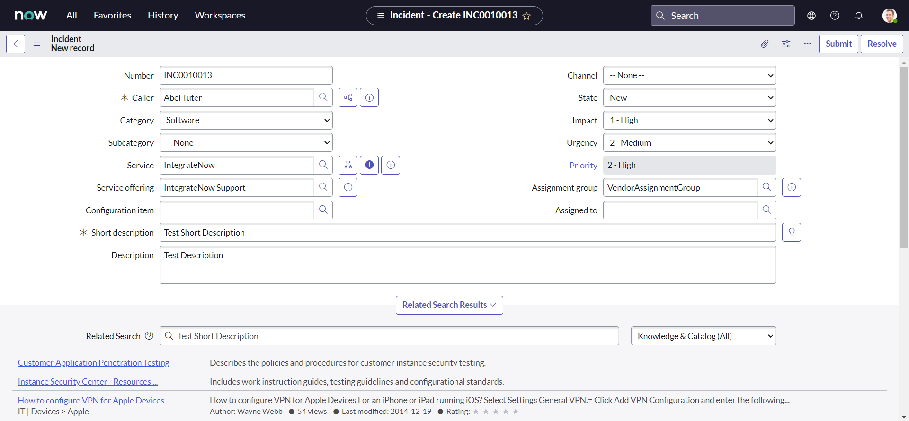
- We can notice from the worknotes, that our API has successfully been triggered and returned the response back:
  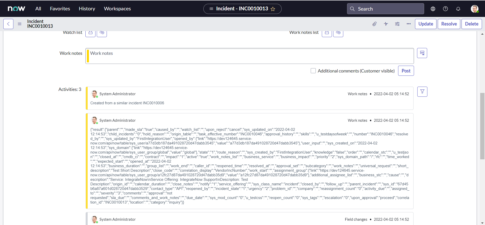
- we can validate the implementation by personalizing incident list view and bringing both the Correlation fields to list :
  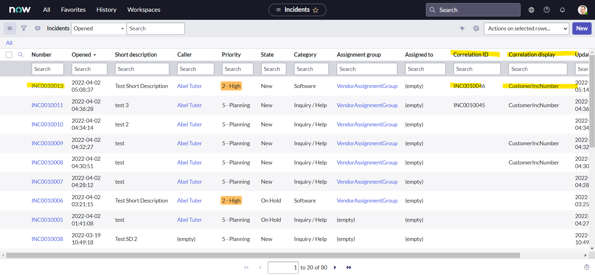
- Similarly, on customer instance, we can personalize incident list view by bringing both the Correlation fields to list view :
  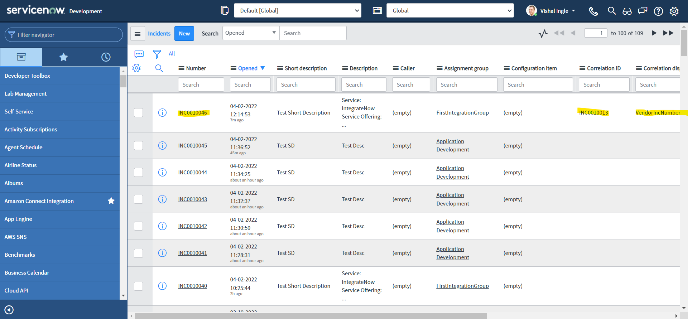

## Your assignment

&nbsp;&nbsp;&nbsp;&nbsp;If you have noticed closely, we are still not passing the incident caller to our API and Hence, caller_id field is empty on our customer instance. Assuming their can be duplicate users with same name and email id but unique user name or user id, modify our script accordingly to set the caller.

---

## What's next?

&nbsp;&nbsp;&nbsp;&nbsp; In the next chapter, we will visit another conceptual aside section to learn everything we need to work with XML responses. This is going to be extermely useful for us to work with the integration systems that handles only XML responses.
