## Chapter 6

# Working With XMLs

&nbsp;&nbsp;&nbsp;&nbsp;So far, we have worked with easier JSON responses, but often we need to work with other types e.g. XML, YAML or CSV. Understanding how to work with XMLs is extermely important not only when you work with web services like RSS or SOAP, but also REST when you receive back the responses in XML format. In this chapter, we will try to learn some of the important concepts regarding XML that will help us to work with XML when we interact with them. Here, we will try to limit ourselves to only concepts essential to work with ServiceNow web services and it is extremely important that we understand them very well. If you want to learn more about these concepts, the best place is [XML Tutorial](https://www.w3schools.com/xml/default.asp) on w3schools.com.


&nbsp;&nbsp;&nbsp;&nbsp;**XML** or **Extensible Markup Language** is a markup language much like HTML, but without predefined tags to use. Instead, you define your own tags designed specifically for your needs. **XML was designed and is a powerful way to store and transport data in a format that can be both human and machine-readable.** Because of the custom tags, it's something that humans can read and understand. Web services use XML to code and to decode data, and SOAP to transport it.

&nbsp;&nbsp;&nbsp;&nbsp;Many finds working with XML difficult because of its structured nature, which requires more efforts for parsing the XML document. But once you understand the magic that is known as XML, you will be amazed with it's capabilities. And most important thing about XML is, it is everywhere!


## Structure of an XML document

&nbsp;&nbsp;&nbsp;&nbsp;XML describes a class of data objects called XML documents. The whole structure of XML is built on tags. Use the Application Navigator to open **REST > REST API Explorer**:
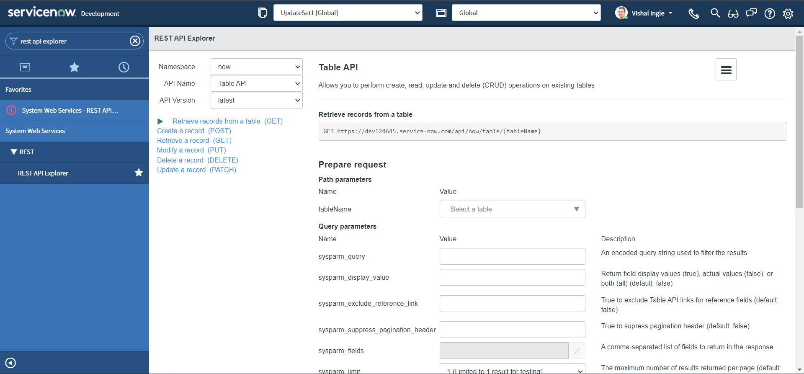
&nbsp;&nbsp;&nbsp;&nbsp;In the top-left of the REST API Explorer, Make sure that method selected is **Retrieve records from a table (GET)**. In the Path Parameters section, select the **Incident (incident)** table.
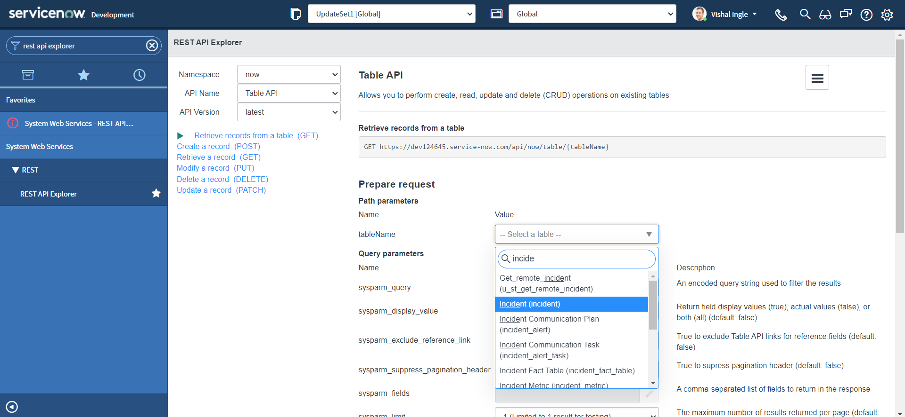
&nbsp;&nbsp;&nbsp;&nbsp;The response by default will return all the incident fields, but we will only need a couple of the fields back in our response, We can specify those in the **sysparm_fields** parameter. Let us limit sysparm_fields to Number, Caller and Short Description:
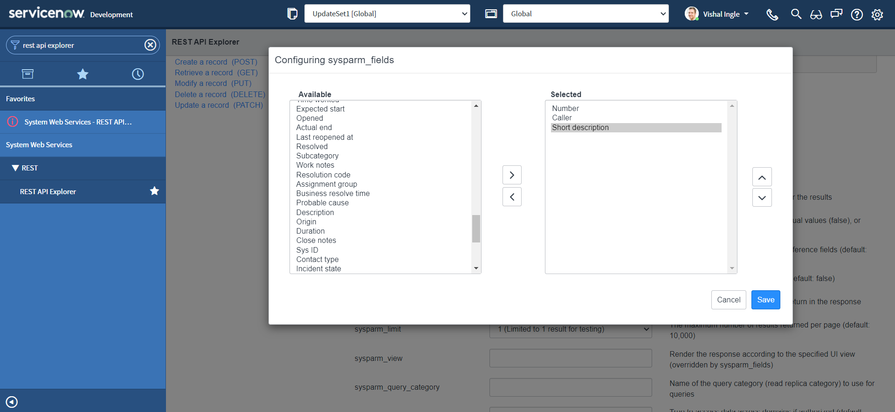
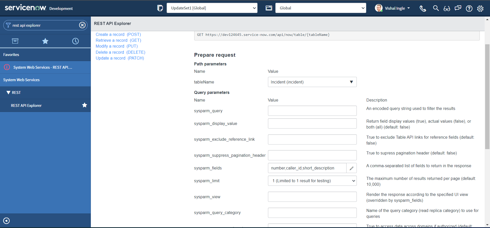
&nbsp;&nbsp;&nbsp;&nbsp;Let us change the Reesponse format to **application/xml** and click **Send**.
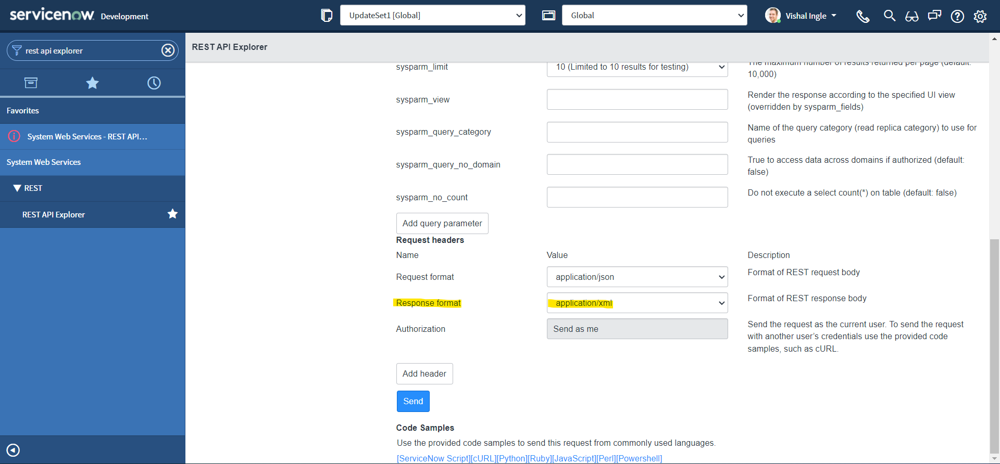

&nbsp;&nbsp;&nbsp;&nbsp;Observe the response body. This, like JSON, is a single line response that we received and is difficult to read:
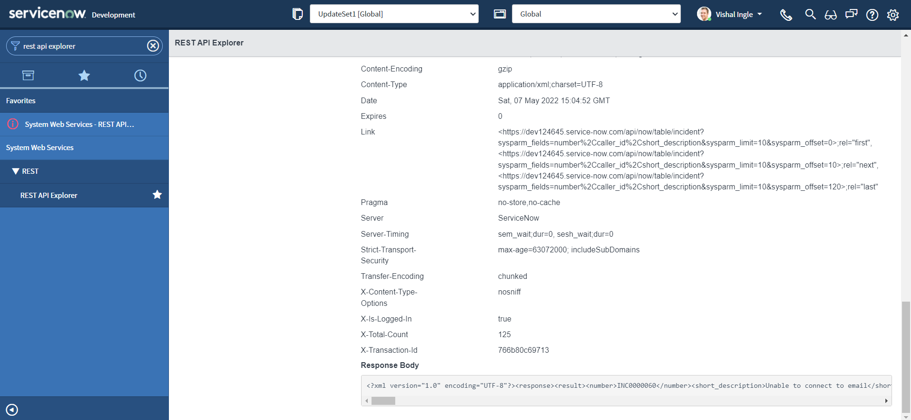

```xml
<?xml version="1.0" encoding="UTF-8"?><response><result><number>INC0000060</number><short_description>Unable to connect to email</short_description><caller_id><link>https://dev124645.service-now.com/api/now/table/sys_user/681ccaf9c0a8016400b98a06818d57c7</link><value>681ccaf9c0a8016400b98a06818d57c7</value></caller_id></result></response>
```

&nbsp;&nbsp;&nbsp;&nbsp;Let us copy the response and paste it into online prettifier tools like [JSON formatter](https://jsonformatter.org/xml-pretty-print) or [Code Beautify](https://codebeautify.org/xml-pretty-print), which will prettify our XML like below :

```xml
<?xml version="1.0" encoding="UTF-8"?>
<response>
	<result>
		<number>INC0000060</number>
		<short_description>Unable to connect to email</short_description>
		<caller_id>
			<link>https://dev124645.service-now.com/api/now/table/sys_user/681ccaf9c0a8016400b98a06818d57c7</link>
			<value>681ccaf9c0a8016400b98a06818d57c7</value>
		</caller_id>
	</result>
</response>
```

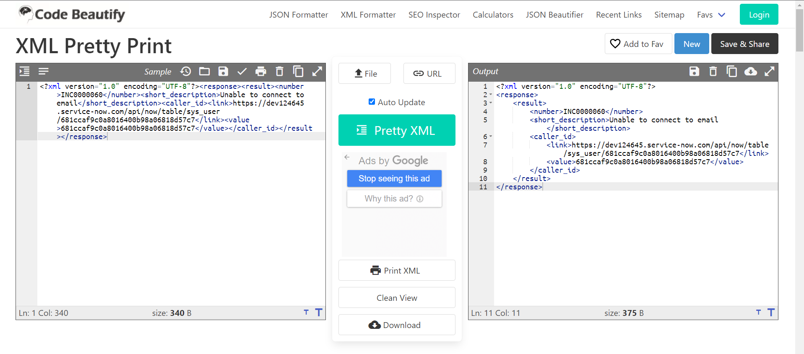
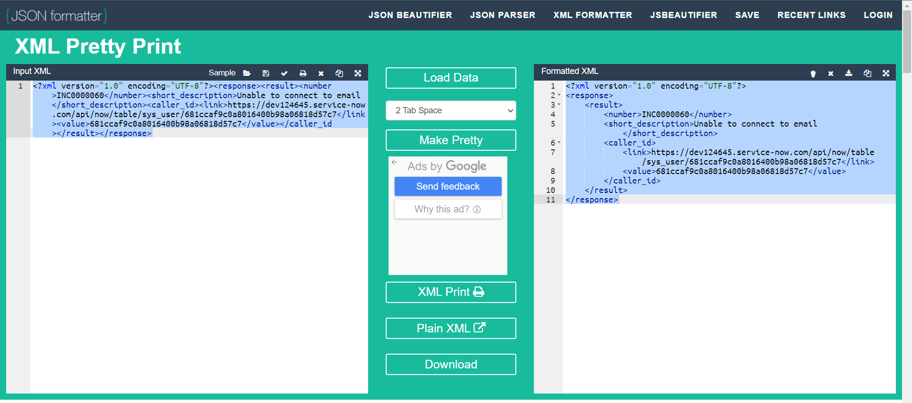

&nbsp;&nbsp;&nbsp;&nbsp;Here, The document starts with a `<response>` tag, followed by a `<result>` element that gives the information about the incident i.e Number, Short Description and Caller. Also, The tags are closed in a sequence; `<response>` tag is closed after the `<result>` tag with the use of `/` character.

&nbsp;&nbsp;&nbsp;&nbsp;However, notice the very first line of our example, which is also known as **XML prolog**:

```xml
<?xml version="1.0" encoding="UTF-8"?>
```

&nbsp;&nbsp;&nbsp;&nbsp;The above line of code is not a tag. It is used just for the transmission of the meta-data of a document i.e. version & character encoding used in the document. The XML prolog is optional. If it exists, it must come first in the document.

&nbsp;&nbsp;&nbsp;&nbsp;**XML documents form a tree structure that starts at "the root" and branches to "the leaves".** The XML above is quite self-descriptive:

- It has a information about Incident Number i.e. `INC0000060` specified in the `number` tag.
- It has a information about incident Short Description i.e. `Unable to connect to email` specified in the `short_description` tag.
- It has a a information about incident Caller specified in the `caller_id` tag. Element `caller_id` has the two child elements:
  - `link` tag provides the API endpoint, which can be used to fetch information about the Incident caller i.e. `https://dev124645.service-now.com/api/now/table/sys_user/681ccaf9c0a8016400b98a06818d57c7`
  - `value` tag provides the SysID of the Incident caller i.e. `681ccaf9c0a8016400b98a06818d57c7`

&nbsp;&nbsp;&nbsp;&nbsp;The tags in the example above (like `<number>` and `<link>`) are not defined in any XML standard. These tags are "invented" by the author of the XML document.

&nbsp;&nbsp;&nbsp;&nbsp;The first line after the prolog defines the **root element** of the document:

```xml
<response>
```

&nbsp;&nbsp;&nbsp;&nbsp;The next line starts a `<result>` element, which is a child element of response:

```xml
<result>
```

&nbsp;&nbsp;&nbsp;&nbsp;The `<result>` element have 3 child elements: `<number>`, `<short_description>` & `<caller_id>`. Similarly, `<caller_id>` have 2 child elements: `<link>` and `<value>`.

&nbsp;&nbsp;&nbsp;&nbsp;One of the important point to remember here is, **XML stores data in plain text format**. This provides a software- and hardware-independent way of storing, transporting, and sharing data.

## The XML Tree Structure

&nbsp;&nbsp;&nbsp;&nbsp;**An XML tree starts at a root element and branches from the root to child elements and all elements can have sub elements (child elements).**

- The terms parent, child, and sibling are used to describe the relationships between elements.
- Parents have children.
- Children have parents.
- Siblings are children on the same level (brothers and sisters).
- All elements can have text content and attributes.

```xml
<root>
  <child>
    <subchild>.....</subchild>
  </child>
</root>
```

&nbsp;&nbsp;&nbsp;&nbsp;Consider the below image, copied from [w3schools.com](https://www.w3schools.com/xml/xml_tree.asp):


&nbsp;&nbsp;&nbsp;&nbsp;The image above represents books in this XML:

```xml
<?xml version="1.0" encoding="UTF-8"?>
<bookstore>
  <book category="cooking">
    <title lang="en">Everyday Italian</title>
    <author>Giada De Laurentiis</author>
    <year>2005</year>
    <price>30.00</price>
  </book>
  <book category="children">
    <title lang="en">Harry Potter</title>
    <author>J K. Rowling</author>
    <year>2005</year>
    <price>29.99</price>
  </book>
  <book category="web">
    <title lang="en">Learning XML</title>
    <author>Erik T. Ray</author>
    <year>2003</year>
    <price>39.95</price>
  </book>
</bookstore>
```

&nbsp;&nbsp;&nbsp;&nbsp;**An XML element is everything from (including) the element's start tag to (including) the element's end tag** and an element can contain:

- text
- attributes
- other elements
- a mix of the above

&nbsp;&nbsp;&nbsp;&nbsp;In the example above:

- `<title>`, `<author>`, `<year>`, and `<price>` have text content because they contain text (like 29.99).
- `<bookstore>` and `<book>` have element contents, because they contain elements.
- `<book>` has an attribute (`category="children"`).

&nbsp;&nbsp;&nbsp;&nbsp;An element with no content is said to be empty. In XML, you can indicate an empty element like this:

```xml
<business_service></business_service>
```

OR you can also use a so called self-closing tag:

```xml
<business_service/>
```

&nbsp;&nbsp;&nbsp;&nbsp;**XML elements can have attributes, designed to contain data related to a specific element.** Attribute values must always be quoted. Either single or double quotes can be used. E.g. a display_value attribute is used in this example:

```xml
<xml>
    <incident>
        <active>true</active>
        <caller_id  display_value="Joe Employee">681ccaf9c0a8016400b98a06818d57c7</caller_id>
        <category>network</category>
        <short_description>Wireless access is down in my area</short_description>
    </incident>
</xml>
```

&nbsp;&nbsp;&nbsp;&nbsp;**The metadata (data about data) should be stored as attributes, and the data itself should be stored as elements.** E.g. The id attributes below are for identifying the different notes. It is not a part of the note itself.

```xml
<messages>
  <note id="501">
    <to>Tove</to>
    <from>Jani</from>
    <heading>Reminder</heading>
    <body>Don't forget me this weekend!</body>
  </note>
  <note id="502">
    <to>Jani</to>
    <from>Tove</from>
    <heading>Re: Reminder</heading>
    <body>I will not</body>
  </note>
</messages>
```

## XML design rules

&nbsp;&nbsp;&nbsp;&nbsp;XML document must be well-formed. XML documents that conform to the syntax rules below are said to be "Well Formed" XML documents:

- XML documents must contain one root element that is the parent of all other elements:

```xml
<root>
  <child>
    <subchild>.....</subchild>
  </child>
</root>
```

&nbsp;&nbsp;&nbsp;&nbsp;In this example `<response>` is the root element:

```xml
<?xml version="1.0" encoding="UTF-8"?>
<response>
	<result>
		<number>INC0000060</number>
		<short_description>Unable to connect to email</short_description>
		<caller_id>
			<link>https://dev124645.service-now.com/api/now/table/sys_user/681ccaf9c0a8016400b98a06818d57c7</link>
			<value>681ccaf9c0a8016400b98a06818d57c7</value>
		</caller_id>
	</result>
</response>
```

- Element names must start with a letter or underscore.

- Element names cannot start with the letters xml (or XML, or Xml, etc).

- Element names can contain letters, digits, hyphens, underscores, and periods.

- Element names cannot contain spaces.

- In XML, it is illegal to omit the closing tag. All elements must have a closing tag:

```xml
<actions_taken/>
<active>true</active>
```

- XML tags are case sensitive. The tag `<Active>` is different from the tag `<active>`. Opening and closing tags must be written with the same case:

```xml
<short_description>Wireless access is down in my area</short_description>
```

- In XML, all elements must be properly nested within each other. E.g. In the example below, "Properly nested" simply means that since the `<active>` element is opened inside the `<incident>` element, it must be closed inside the `<incident>` element:

```xml
<incident>
  <active>true</active>
</incident>
```

- XML elements can have attributes in name/value pairs just like in HTML. In XML, the attribute values must always be quoted:

```xml
<assignment_group display_value="Incident Management" name="Incident Management">12a586cd0bb23200ecfd818393673a30</assignment_group>
```

- Some characters have a special meaning in XML, they should be replaced with an entity reference. E.g. If you place a character like "<" inside an XML element, it will generate an error because the parser interprets it as the start of a new element and it should be replaced with an entity reference `&lt;`:

```xml
<message>salary &lt; 1000</message>
```

- XML stores a new line as LF.

- Avoid "-". If you name something "first-name", some software may think you want to subtract "name" from "first".

- Avoid ".". If you name something "first.name", some software may think that "name" is a property of the object "first".

- Avoid ":". Colons are reserved for namespaces.

## XML DOM

&nbsp;&nbsp;&nbsp;&nbsp;The **XML DOM defines a standard way for accessing and manipulating XML documents.** It presents an XML document as a tree-structure. The XML DOM is a standard for how to get, change, add, and delete XML elements. All XML elements can be accessed through the XML DOM. Understanding the DOM is a must for anyone working with XML. You can use online tools such [XML Viewer](https://www.xmlviewer.org/) to visualize a tree structure of our XML document:
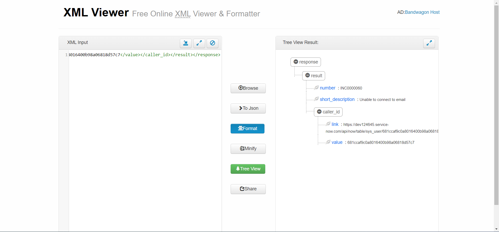

## XML Parser & XMLDocument2

&nbsp;&nbsp;&nbsp;&nbsp;XML parser can convert text into an XML DOM object. ServiceNow provides a JavaScript Object wrapper for parsing and extracting XML data from an XML string known as **XMLDocument2**. An XML string has a tree structure, and the parts of the structure are called nodes. An XMLDocument2 object deals with two node types: element, and document element (root node of the XML tree).

&nbsp;&nbsp;&nbsp;&nbsp;Let us generate the snippet for the GET method that we did use earlier to receive Incident information:

- To create the code sample, Navigate back to REST API Explorer window and click the link for the language of your choice in the REST API Explorer. For the sake of this example, we will select **"ServiceNow Script"**.
  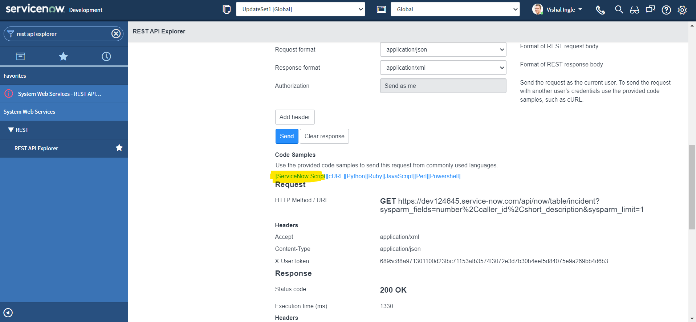
- To highlight the code sample for copying, click the **Select Snippet** button.
  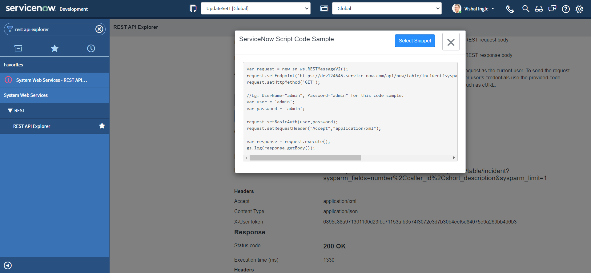
- After highlighting the code sample, **copy the code sample to the clipboard** by using ctrl+c.
  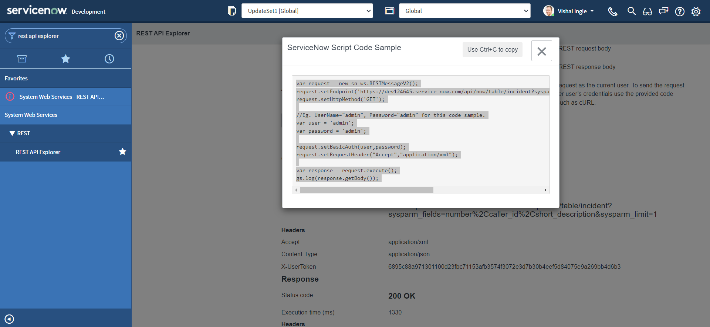

&nbsp;&nbsp;&nbsp;&nbsp;If you did everything correctly you should have the code which look similar to the following copied to your clipboard:

```js
var request = new sn_ws.RESTMessageV2()
request.setEndpoint(
  "https://dev124645.service-now.com/api/now/table/incident?sysparm_fields=number%2Ccaller_id%2Cshort_description&sysparm_limit=1"
)
request.setHttpMethod("GET")

//Eg. UserName="admin", Password="admin" for this code sample.
var user = "admin"
var password = "admin"

request.setBasicAuth(user, password)
request.setRequestHeader("Accept", "application/xml")

var response = request.execute()
gs.log(response.getBody())
```

&nbsp;&nbsp;&nbsp;&nbsp;It is time to visit our old good friend. Use the Application Navigator to open **System Definition > Scripts - Background** and Paste the snippet that we did copy from last step into the Run Script field.
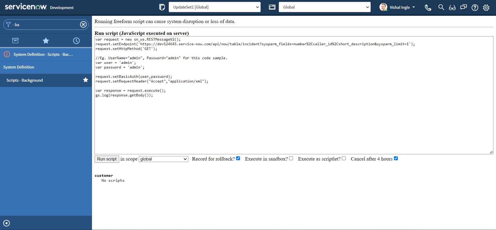
&nbsp;&nbsp;&nbsp;&nbsp;Let us modify our code to change the fake credentials by your admin credentials, and re-execute the script and Click the **Run script** button to view the results of the script:

```js
var request = new sn_ws.RESTMessageV2()
request.setEndpoint(
  "https://dev124645.service-now.com/api/now/table/incident?sysparm_fields=number%2Ccaller_id%2Cshort_description&sysparm_limit=1"
)
request.setHttpMethod("GET")

//Eg. UserName="admin", Password="admin" for this code sample.
var user = "MyAdminUserName"
var password = "MyAdminPassword"

request.setBasicAuth(user, password)
request.setRequestHeader("Accept", "application/xml")

var response = request.execute()
gs.log(response.getBody())
```

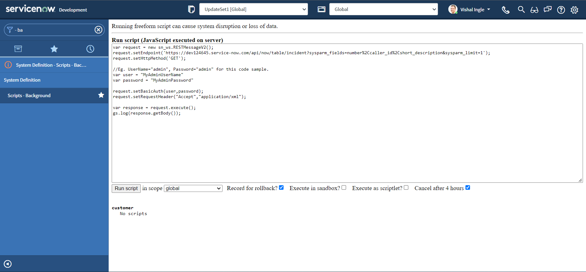
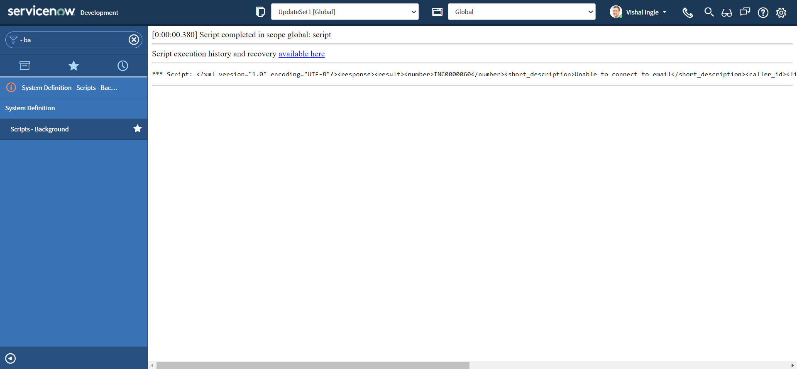

&nbsp;&nbsp;&nbsp;&nbsp;Well, we received the XML response back from our API, but just like JSON responses, it is a XML string. Let us add **typeof** to the logger function to get the type of our response and re-execute the script:

```js
var request = new sn_ws.RESTMessageV2()
request.setEndpoint(
  "https://dev124645.service-now.com/api/now/table/incident?sysparm_fields=number%2Ccaller_id%2Cshort_description&sysparm_limit=1"
)
request.setHttpMethod("GET")

//Eg. UserName="admin", Password="admin" for this code sample.
var user = "MyAdminUserName"
var password = "MyAdminPassword"

request.setBasicAuth(user, password)
request.setRequestHeader("Accept", "application/xml")

var response = request.execute()
gs.log(typeof response.getBody())
```

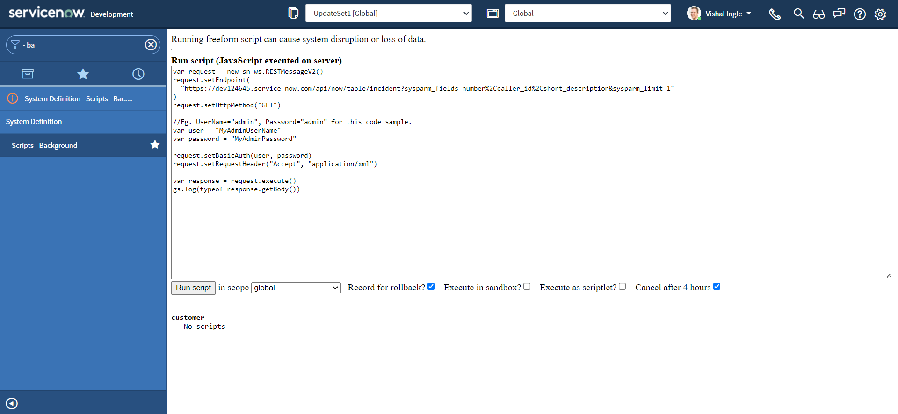
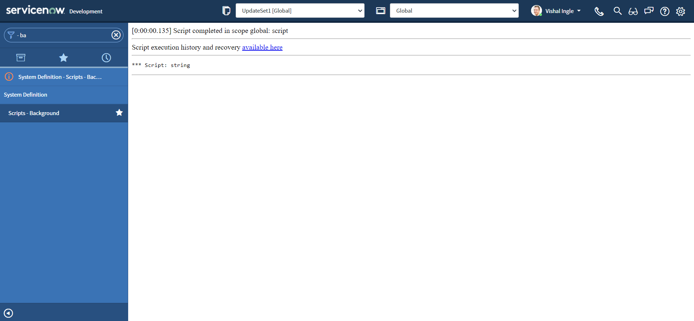

### XMLDocument2 & parseXML

&nbsp;&nbsp;&nbsp;&nbsp;**XMLDocument2() Creates an XMLDocument2 object.** we can use JavaScript class "XMLDocument2" to create an object from an XML string. **parseXML** method parses the XML string and loads it into the XMLDocument2 object. Lets modify our code and re-execute the script:

```js
var request = new sn_ws.RESTMessageV2()
request.setEndpoint(
  "https://dev124645.service-now.com/api/now/table/incident?sysparm_fields=number%2Ccaller_id%2Cshort_description&sysparm_limit=1"
)
request.setHttpMethod("GET")

//Eg. UserName="admin", Password="admin" for this code sample.
var user = "MyAdminUserName"
var password = "MyAdminPassword"

request.setBasicAuth(user, password)
request.setRequestHeader("Accept", "application/xml")

var response = request.execute()

var xmlString = response.getBody()

var xmlDoc = new XMLDocument2()
xmlDoc.parseXML(xmlString)

gs.log(typeof xmlDoc)
gs.log(xmlDoc)
```

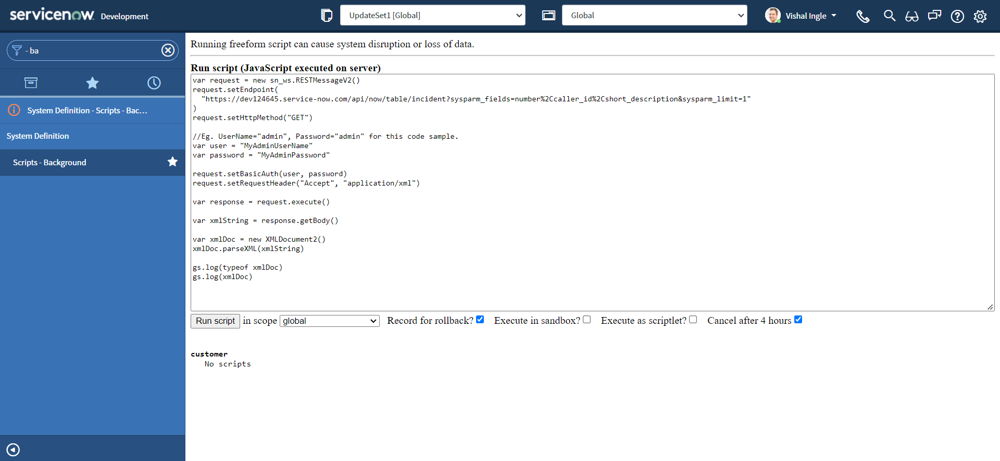

&nbsp;&nbsp;&nbsp;&nbsp;As we can see from the output, we have converted our string representation of XML into XMLDocument2 object.


### getDocumentElement

&nbsp;&nbsp;&nbsp;&nbsp;**getDocumentElement** gets the document element node of the XMLdocument2 object. The document element node is the root node. Lets modify our code and re-execute the script:

```js
var request = new sn_ws.RESTMessageV2()
request.setEndpoint(
  "https://dev124645.service-now.com/api/now/table/incident?sysparm_fields=number%2Ccaller_id%2Cshort_description&sysparm_limit=1"
)
request.setHttpMethod("GET")

//Eg. UserName="admin", Password="admin" for this code sample.
var user = "MyAdminUserName"
var password = "MyAdminPassword"

request.setBasicAuth(user, password)
request.setRequestHeader("Accept", "application/xml")

var response = request.execute()

var xmlString = response.getBody()

var xmlDoc = new XMLDocument2()
xmlDoc.parseXML(xmlString)

//returns the root node of the document tree.
var rootNode = xmlDoc.getDocumentElement()
gs.info(rootNode)
```

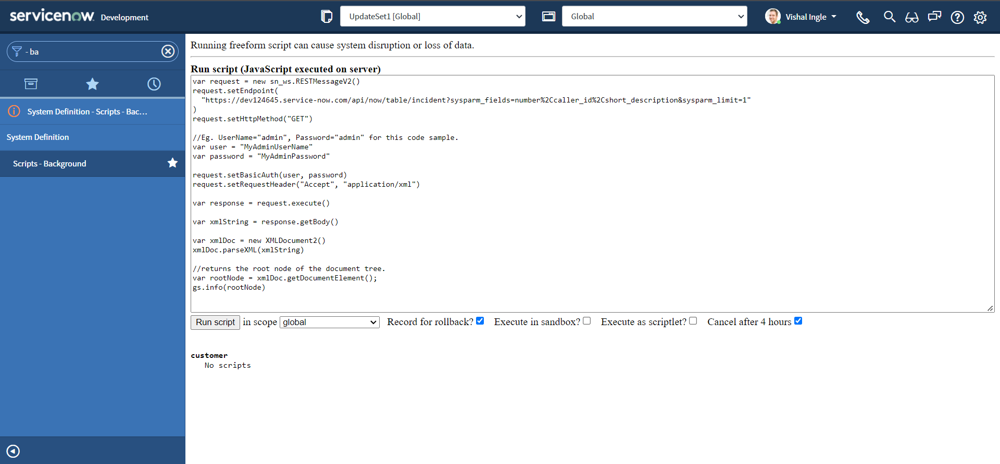
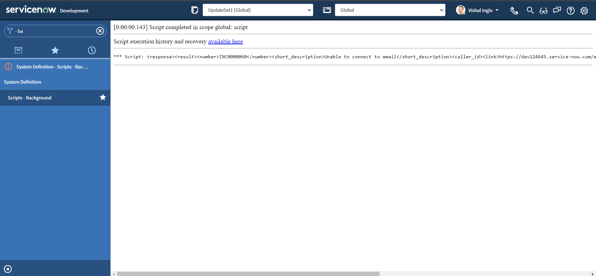

### XPath

&nbsp;&nbsp;&nbsp;&nbsp;XPath stands for XML Path Language. **XPath can be used to navigate through elements and attributes in an XML document.** It uses path expressions to navigate in XML documents. These path expressions look very much like the expressions you see when you work with a traditional computer file system.

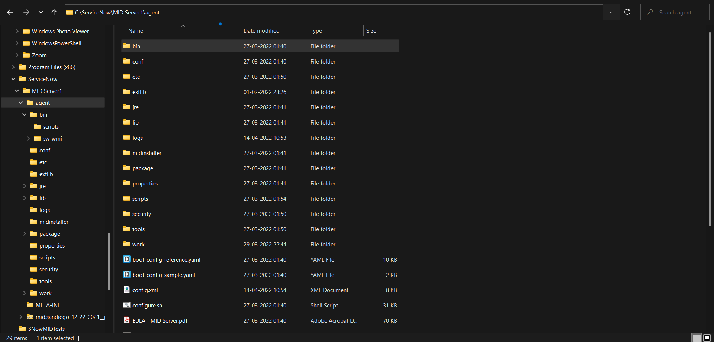

&nbsp;&nbsp;&nbsp;&nbsp;XML documents are treated as trees of nodes. In XPath, there are seven kinds of nodes: element, attribute, text, namespace, processing-instruction, comment, and document nodes. The topmost element of the tree is called the root element. Look at the following XML document:

```xml
<?xml version="1.0" encoding="UTF-8"?>

<bookstore>

<book category="cooking">
  <title lang="en">Everyday Italian</title>
  <author>Giada De Laurentiis</author>
  <year>2005</year>
  <price>30.00</price>
</book>

<book category="children">
  <title lang="en">Harry Potter</title>
  <author>J K. Rowling</author>
  <year>2005</year>
  <price>29.99</price>
</book>

<book category="web">
  <title lang="en">XQuery Kick Start</title>
  <author>James McGovern</author>
  <author>Per Bothner</author>
  <author>Kurt Cagle</author>
  <author>James Linn</author>
  <author>Vaidyanathan Nagarajan</author>
  <year>2003</year>
  <price>49.99</price>
</book>

<book category="web">
  <title lang="en">Learning XML</title>
  <author>Erik T. Ray</author>
  <year>2003</year>
  <price>39.95</price>
</book>

</bookstore>
```

&nbsp;&nbsp;&nbsp;&nbsp;Example of nodes in the XML document above:

```xml
<bookstore> (root element node)

<author>J K. Rowling</author> (element node)

lang="en" (attribute node)
```

### Selecting Nodes

&nbsp;&nbsp;&nbsp;&nbsp;XPath uses path expressions to select nodes in an XML document. The node is selected by following a path or steps. The most useful path expressions are listed below:

| Expression | Description                                                                                           | Example         | Result                                                                                                                       |
| ---------- | ----------------------------------------------------------------------------------------------------- | --------------- | ---------------------------------------------------------------------------------------------------------------------------- |
| nodename   | Selects all nodes with the name "nodename"                                                            | bookstore       | Selects all nodes with the name "bookstore"                                                                                  |
| /          | Selects from the root node                                                                            | /bookstore      | Selects the root element bookstore                                                                                           |
|            |                                                                                                       | bookstore/book  | Selects all book elements that are children of bookstore                                                                     |
| //         | Selects nodes in the document from the current node that match the selection no matter where they are | //book          | Selects all book elements no matter where they are in the document                                                           |
|            |                                                                                                       | bookstore//book | Selects all book elements that are descendant of the bookstore element, no matter where they are under the bookstore element |
| .          | Selects the current node                                                                              |
| ..         | Selects the parent of the current node                                                                |
| @          | Selects attributes                                                                                    | //@             | lang Selects all attributes that are named lang                                                                              |

### Predicates

&nbsp;&nbsp;&nbsp;&nbsp;Predicates are used to find a specific node or a node that contains a specific value. Predicates are always embedded in square brackets. In the table below we have listed some path expressions with predicates and the result of the expressions:

| Path Expression                    | Result                                                                                                                                 |
| ---------------------------------- | -------------------------------------------------------------------------------------------------------------------------------------- |
| /bookstore/book[1]                 | Selects the first book element that is the child of the bookstore element.                                                             |
| /bookstore/book[last()]            | Selects the last book element that is the child of the bookstore element                                                               |
| /bookstore/book[last()-1]          | Selects the last but one book element that is the child of the bookstore element                                                       |
| /bookstore/book[position()<3]      | Selects the first two book elements that are children of the bookstore element                                                         |
| //title[@lang]                     | Selects all the title elements that have an attribute named lang                                                                       |
| //title[@lang='en']                | Selects all the title elements that have a "lang" attribute with a value of "en"                                                       |
| /bookstore/book[price>35.00]       | Selects all the book elements of the bookstore element that have a price element with a value greater than 35.00                       |
| /bookstore/book[price>35.00]/title | Selects all the title elements of the book elements of the bookstore element that have a price element with a value greater than 35.00 |

### Selecting Unknown Nodes

&nbsp;&nbsp;&nbsp;&nbsp;XPath wildcards can be used to select unknown XML nodes. In the table below we have listed some path expressions and the result of the expressions:

| Wildcard | Description                  | Path Expression | Result                                                                   |
| -------- | ---------------------------- | --------------- | ------------------------------------------------------------------------ |
| \*       | Matches any element node     | /bookstore/\*   | Selects all the child element nodes of the bookstore element             |
|          |                              | //\*            | Selects all elements in the document                                     |
| @\*      | Matches any attribute node   | //title[@*]     | Selects all title elements which have at least one attribute of any kind |
| node()   | Matches any node of any kind |                 |                                                                          |

### Selecting Several Paths

&nbsp;&nbsp;&nbsp;&nbsp;By using the **|** operator in an XPath expression you can select several paths. In the table below we have listed some path expressions and the result of the expressions:

| Path Expression                  | Result                                                                                                                 |
| -------------------------------- | ---------------------------------------------------------------------------------------------------------------------- |
| //book/title \| //book/price     | Selects all the title AND price elements of all book elements                                                          |
| //title \| //price               | Selects all the title AND price elements in the document                                                               |
| /bookstore/book/title \| //price | Selects all the title elements of the book element of the bookstore element AND all the price elements in the document |

### XPath Axes

&nbsp;&nbsp;&nbsp;&nbsp;An axis represents a relationship to the context (current) node, and is used to locate nodes relative to that node on the tree.

| AxisName           | Result                                                                                                                       |
| ------------------ | ---------------------------------------------------------------------------------------------------------------------------- |
| ancestor           | Selects all ancestors (parent, grandparent, etc.) of the current node                                                        |
| ancestor-or-self   | Selects all ancestors (parent, grandparent, etc.) of the current node and the current node itself                            |
| attribute          | Selects all attributes of the current node                                                                                   |
| child              | Selects all children of the current node                                                                                     |
| descendant         | Selects all descendants (children, grandchildren, etc.) of the current node                                                  |
| descendant-or-self | Selects all descendants (children, grandchildren, etc.) of the current node and the current node itself                      |
| following          | Selects everything in the document after the closing tag of the current node                                                 |
| following-sibling  | Selects all siblings after the current node                                                                                  |
| namespace          | Selects all namespace nodes of the current node                                                                              |
| parent             | Selects the parent of the current node                                                                                       |
| preceding          | Selects all nodes that appear before the current node in the document, except ancestors, attribute nodes and namespace nodes |
| preceding-sibling  | Selects all siblings before the current node                                                                                 |
| self               | Selects the current node                                                                                                     |

### Location Path Expression

&nbsp;&nbsp;&nbsp;&nbsp;A location path can be absolute or relative. An absolute location path starts with a slash ( / ) and a relative location path does not. In both cases the location path consists of one or more steps, each separated by a slash:

```xml
An absolute location path:

/step/step/...

A relative location path:

step/step/...
```

&nbsp;&nbsp;&nbsp;&nbsp;The syntax for a location step is:

```xml
axisname::nodetest[predicate]
```

| Example                | Result                                                                                        |
| ---------------------- | --------------------------------------------------------------------------------------------- |
| child::book            | Selects all book nodes that are children of the current node                                  |
| attribute::lang        | Selects the lang attribute of the current node                                                |
| child::\*              | Selects all element children of the current node                                              |
| attribute::\*          | Selects all attributes of the current node                                                    |
| child::text()          | Selects all text node children of the current node                                            |
| child::node()          | Selects all children of the current node                                                      |
| descendant::book       | Selects all book descendants of the current node                                              |
| ancestor::book         | Selects all book ancestors of the current node                                                |
| ancestor-or-self::book | Selects all book ancestors of the current node - and the current as well if it is a book node |
| child::\*/child::price | Selects all price grandchildren of the current node                                           |

### getNode & getNodeText

&nbsp;&nbsp;&nbsp;&nbsp;**getNode** gets the node specified in the xPath. **getNodeText** gets all the text child nodes from the node referenced in the specified XPath. Let us modify our code to fetch the `number` element from our response and re-execute the script:

```js
var request = new sn_ws.RESTMessageV2()
request.setEndpoint(
  "https://dev124645.service-now.com/api/now/table/incident?sysparm_fields=number%2Ccaller_id%2Cshort_description&sysparm_limit=1"
)
request.setHttpMethod("GET")

//Eg. UserName="admin", Password="admin" for this code sample.
var user = "MyAdminUserName"
var password = "MyAdminPassword"

request.setBasicAuth(user, password)
request.setRequestHeader("Accept", "application/xml")

var response = request.execute()

var xmlString = response.getBody()

var xmlDoc = new XMLDocument2()
xmlDoc.parseXML(xmlString)

var node = xmlDoc.getNode("/response/result/number")
gs.info(node)
```


&nbsp;&nbsp;&nbsp;&nbsp;Your output should look something like this:

```xml
<number>INC0000060</number>
```

&nbsp;&nbsp;&nbsp;&nbsp;If you are wondering how the result of the background script is displayed on the same page, that is probabaly because you are unaware of an awesome extension [SN Utils](https://www.arnoudkooi.com/) by Arnoud Kooi. I strongly encourage you to have this extension installed on your personal computer to learn the amazing capabilities of this extension and increase your productivity.

&nbsp;&nbsp;&nbsp;&nbsp;Now, lets modify the script one more time to get the incident number from number element:

```js
var request = new sn_ws.RESTMessageV2()
request.setEndpoint(
  "https://dev124645.service-now.com/api/now/table/incident?sysparm_fields=number%2Ccaller_id%2Cshort_description&sysparm_limit=1"
)
request.setHttpMethod("GET")

//Eg. UserName="admin", Password="admin" for this code sample.
var user = "MyAdminUserName"
var password = "MyAdminPassword"

request.setBasicAuth(user, password)
request.setRequestHeader("Accept", "application/xml")

var response = request.execute()

var xmlString = response.getBody()

var xmlDoc = new XMLDocument2()
xmlDoc.parseXML(xmlString)

var nodeText = xmlDoc.getNodeText("/response/result/number")
gs.info(nodeText)
```

&nbsp;&nbsp;&nbsp;&nbsp;After executing the script, your output should look something similar to the following:

```js
INC0000060
```

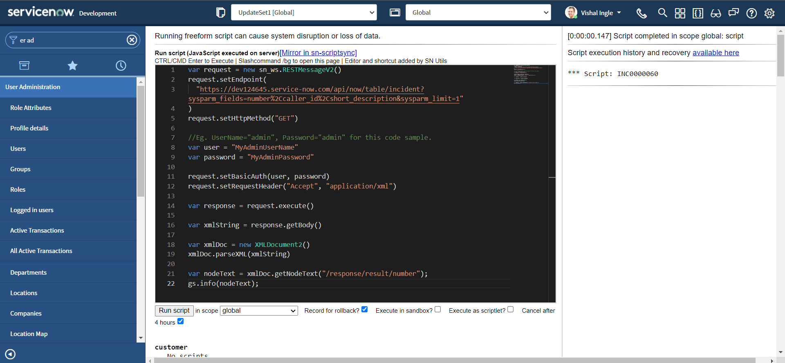

### getFirstNode & getNextNode

&nbsp;&nbsp;&nbsp;&nbsp;**getFirstNode** gets the first node in the specified xPath. **getNextNode** gets the node after the specified node. Let us assume the following document from [ServiceNow API documentation](https://developer.servicenow.com/dev.do#!/reference/api/sandiego/server/no-namespace/c_XMLDocument2ScopedAPI):

```xml
<store>
    <resources company="ABC Inc">
        <resources type="servers" />
    </resources>
    <resources company="XYZ Inc">
        <resource type="bookstore">
            <book>
                <title>Windows</title>
                <price>10</price>
            </book>
            <book year="2009">
                <title>Harry Potter</title>
                <price>50</price>
            </book>
            <book year="1999">
                <title>Learning XML</title>
                <price>120</price>
            </book>
            <book year="2019">
                <title>Learning Java</title>
                <price>99</price>
            </book>
        </resource>
    </resources>
</store>
```

&nbsp;&nbsp;&nbsp;&nbsp;The getFirstNode methods supports the following xPath expressions with predicates:

`/store/resources/resource[@type='bookstore']/book[@year='1999']`
`/store/resources/resource[@type='bookstore']/book[@year]`
`/store/resources/resource[@type='bookstore']/book[price > 100]`

&nbsp;&nbsp;&nbsp;&nbsp;However, it does not support the following xPath expressions with predicates:

`/store/resources/resource[@type='bookstore']/book[2]`
`/store/resources/resource[@type='bookstore']/book[last()]`
`/store/resources/resource[@type='bookstore']/book[position()>2]`

&nbsp;&nbsp;&nbsp;&nbsp;To work around this, use xPath without predicates, such as `/store/resources/resource[@type='bookstore']/book` and then filter the nodes in the script using the getFirstNode() and getNextNode() methods.

&nbsp;&nbsp;&nbsp;&nbsp;Let us modify our code to fetch information about 3 incidents, by setting the **sysparm_limit** query parameter to 3 :

```js
var request = new sn_ws.RESTMessageV2()
request.setEndpoint(
  "https://dev124645.service-now.com/api/now/table/incident?sysparm_fields=number%2Ccaller_id%2Cshort_description&sysparm_limit=3"
)
request.setHttpMethod("GET")

//Eg. UserName="admin", Password="admin" for this code sample.
var user = "MyAdminUserName"
var password = "MyAdminPassword"

request.setBasicAuth(user, password)
request.setRequestHeader("Accept", "application/xml")

var response = request.execute()

var xmlString = response.getBody()

var xmlDoc = new XMLDocument2()
xmlDoc.parseXML(xmlString)

//returns the root node of the document tree.
var rootNode = xmlDoc.getDocumentElement()
gs.info(rootNode)
```

&nbsp;&nbsp;&nbsp;&nbsp;The above script will log the document element tree structure, which should look something like this :

```xml
<response>
	<result>
		<number>INC0000060</number>
		<short_description>Unable to connect to email</short_description>
		<caller_id>
			<link>https://dev124645.service-now.com/api/now/table/sys_user/681ccaf9c0a8016400b98a06818d57c7</link>
			<value>681ccaf9c0a8016400b98a06818d57c7</value>
		</caller_id>
	</result>
	<result>
		<number>INC0009002</number>
		<short_description>My computer is not detecting the headphone device</short_description>
		<caller_id>
			<link>https://dev124645.service-now.com/api/now/table/sys_user/77ad8176731313005754660c4cf6a7de</link>
			<value>77ad8176731313005754660c4cf6a7de</value>
		</caller_id>
	</result>
	<result>
		<number>INC0000009</number>
		<short_description>Reset my password</short_description>
		<caller_id>
			<link>https://dev124645.service-now.com/api/now/table/sys_user/5137153cc611227c000bbd1bd8cd2006</link>
			<value>5137153cc611227c000bbd1bd8cd2006</value>
		</caller_id>
	</result>
</response>
```

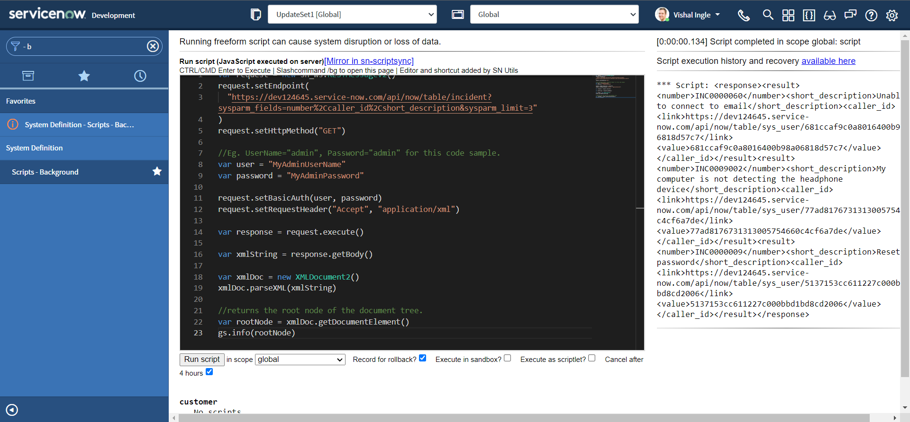

&nbsp;&nbsp;&nbsp;&nbsp;Now, let us observe our output. we have several `result` nodes in our `response` element. To see getFirstNode in action, modify the script as below and re-execute:

```js
var request = new sn_ws.RESTMessageV2()
request.setEndpoint(
  "https://dev124645.service-now.com/api/now/table/incident?sysparm_fields=number%2Ccaller_id%2Cshort_description&sysparm_limit=3"
)
request.setHttpMethod("GET")

//Eg. UserName="admin", Password="admin" for this code sample.
var user = "MyAdminUserName"
var password = "MyAdminPassword"

request.setBasicAuth(user, password)
request.setRequestHeader("Accept", "application/xml")

var response = request.execute()

var xmlString = response.getBody()

var xmlDoc = new XMLDocument2()
xmlDoc.parseXML(xmlString)

var firstIncResult = xmlDoc.getFirstNode("/response/result")
gs.info(firstIncResult)
```

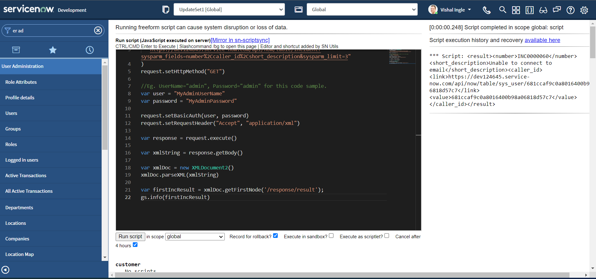

&nbsp;&nbsp;&nbsp;&nbsp;You should receive the output displaying the information about first result node, which looks something like this:

```xml
<result>
	<number>INC0000060</number>
	<short_description>Unable to connect to email</short_description>
	<caller_id>
		<link>https://dev124645.service-now.com/api/now/table/sys_user/681ccaf9c0a8016400b98a06818d57c7</link>
		<value>681ccaf9c0a8016400b98a06818d57c7</value>
	</caller_id>
</result>
```

&nbsp;&nbsp;&nbsp;&nbsp;Now, let us modify the script again to see getNextNode in action as below and re-execute:

```js
var request = new sn_ws.RESTMessageV2()
request.setEndpoint(
  "https://dev124645.service-now.com/api/now/table/incident?sysparm_fields=number%2Ccaller_id%2Cshort_description&sysparm_limit=3"
)
request.setHttpMethod("GET")

//Eg. UserName="admin", Password="admin" for this code sample.
var user = "MyAdminUserName"
var password = "MyAdminPassword"

request.setBasicAuth(user, password)
request.setRequestHeader("Accept", "application/xml")

var response = request.execute()

var xmlString = response.getBody()

var xmlDoc = new XMLDocument2()
xmlDoc.parseXML(xmlString)

var firstIncResult = xmlDoc.getFirstNode("/response/result")

var secondIncResult = xmlDoc.getNextNode(firstIncResult)
gs.info(secondIncResult)
```


&nbsp;&nbsp;&nbsp;&nbsp;You should receive the output displaying the information about second result node, which looks something like this:

```xml
<result>
	<number>INC0009002</number>
	<short_description>My computer is not detecting the headphone device</short_description>
	<caller_id>
		<link>https://dev124645.service-now.com/api/now/table/sys_user/77ad8176731313005754660c4cf6a7de</link>
		<value>77ad8176731313005754660c4cf6a7de</value>
	</caller_id>
</result>
```

&nbsp;&nbsp;&nbsp;&nbsp;The most important thing to notice here is that the parameter (The current node) passed to the getNextNode method. In our example we passed the first result node **firstIncResult** as a parameter to the getNextNode method in order to retrieve the next result node.

### createElement & createElementWithTextValue

&nbsp;&nbsp;&nbsp;&nbsp;**createElement** creates and adds an element node to the current node. The element name is the string passed in as a parameter. The new element has no text child nodes. **createElementWithTextValue** creates and adds an element node with a text child node to the current node. It accepts two string parameters: name of the element to add & element's text value. Lets modify our script to see these two methods in action:

```js
var request = new sn_ws.RESTMessageV2()
request.setEndpoint(
  "https://dev124645.service-now.com/api/now/table/incident?sysparm_fields=number%2Ccaller_id%2Cshort_description&sysparm_limit=1"
)
request.setHttpMethod("GET")

//Eg. UserName="admin", Password="admin" for this code sample.
var user = "MyAdminUserName"
var password = "MyAdminPassword"

request.setBasicAuth(user, password)
request.setRequestHeader("Accept", "application/xml")

var response = request.execute()

var xmlString = response.getBody()

var xmlDoc = new XMLDocument2()
xmlDoc.parseXML(xmlString)

xmlDoc.createElement("new_element_without_text")
xmlDoc.createElementWithTextValue(
  "new_element_with_text",
  "New Element With Text"
)

gs.info(xmlDoc)
```

&nbsp;&nbsp;&nbsp;&nbsp;After execution your output should be similar to the following:

```xml
<?xml version="1.0" encoding="UTF-8"?>
<response>
	<new_element_without_text/>
	<new_element_with_text>New Element With Text</new_element_with_text>
	<result>
		<number>INC0000060</number>
		<short_description>Unable to connect to email</short_description>
		<caller_id>
			<link>https://dev124645.service-now.com/api/now/table/sys_user/681ccaf9c0a8016400b98a06818d57c7</link>
			<value>681ccaf9c0a8016400b98a06818d57c7</value>
		</caller_id>
	</result>
</response>
```

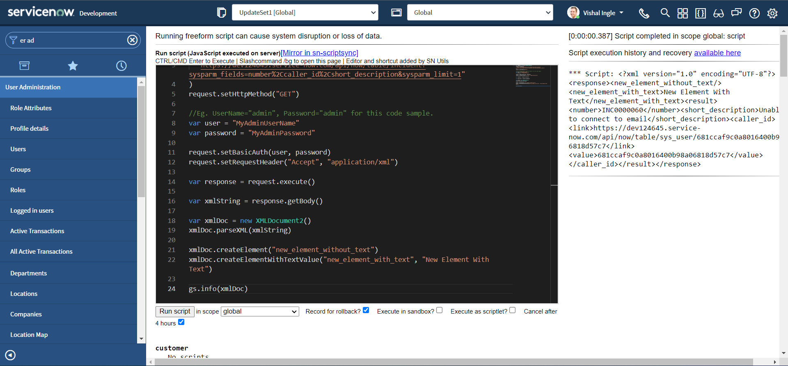

&nbsp;&nbsp;&nbsp;&nbsp;As you can clearly notice, We have two additional nodes added to our document : `new_element_without_text` and `new_element_with_text`.

## xmlToJSON


&nbsp;&nbsp;&nbsp;&nbsp;Though parsing the xml with help of XMLDocument2 is very convinient, We can leverage xmlToJSON method of GlideSystem to convert the xml to JSON object which is easier to work with. **xmlToJSON Takes an XML string and returns a JSON object.** Let us modify the script to understand how this works :

```js
var request = new sn_ws.RESTMessageV2()
request.setEndpoint(
  "https://dev124645.service-now.com/api/now/table/incident?sysparm_fields=number%2Ccaller_id%2Cshort_description&sysparm_limit=1"
)
request.setHttpMethod("GET")

//Eg. UserName="admin", Password="admin" for this code sample.
var user = "MyAdminUserName"
var password = "MyAdminPassword"

request.setBasicAuth(user, password)
request.setRequestHeader("Accept", "application/xml")

var response = request.execute()

var xmlString = response.getBody()

var xmlObj = gs.xmlToJSON(xmlString)

gs.info(JSON.stringify(xmlObj, null, 4))
```

&nbsp;&nbsp;&nbsp;&nbsp;After executing the script, our **xmlObj** contains the JSON object, the last logger function in our script pretty prints the JSON object:

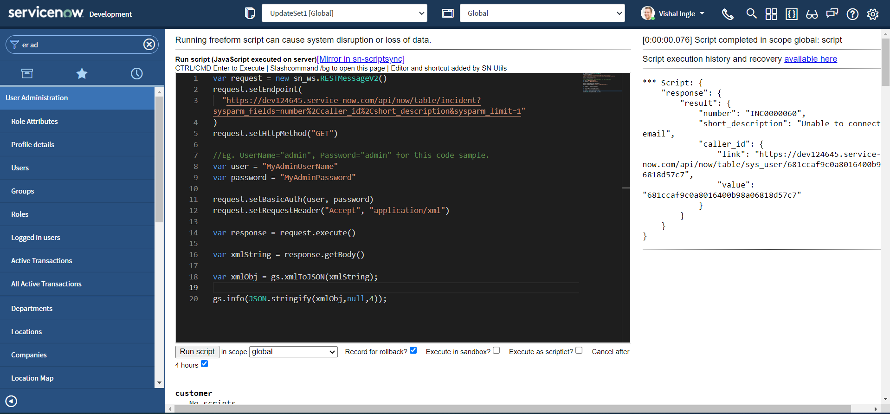

&nbsp;&nbsp;&nbsp;&nbsp;Though, the script worked totally fine, It is important that you pre-process the XML input before passing to xmlToJSON. You can read more about this in the Support article [KB0784264](https://support.servicenow.com/kb?id=kb_article_view&sysparm_article=KB0784264). The modified script looks similar to this:

```js
var request = new sn_ws.RESTMessageV2()
request.setEndpoint(
  "https://dev124645.service-now.com/api/now/table/incident?sysparm_fields=number%2Ccaller_id%2Cshort_description&sysparm_limit=1"
)
request.setHttpMethod("GET")

//Eg. UserName="admin", Password="admin" for this code sample.
var user = "MyAdminUserName"
var password = "MyAdminPassword"

request.setBasicAuth(user, password)
request.setRequestHeader("Accept", "application/xml")

var response = request.execute()

var xmlString = response.getBody()

var xmlDoc = new XMLDocument2()
xmlDoc.parseXML(xmlString)

var rootNode = xmlDoc.getDocumentElement()

var xmlObj = gs.xmlToJSON(rootNode)

gs.info(JSON.stringify(xmlObj, null, 4))
```

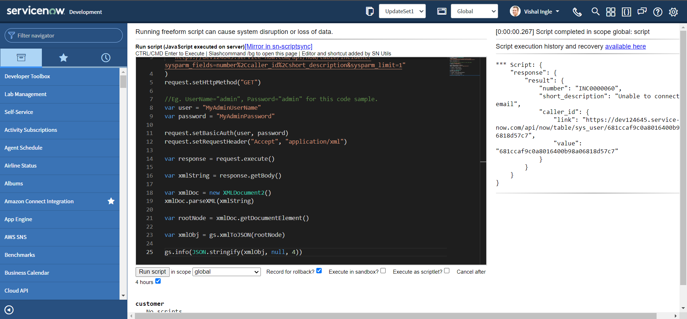

## XMLNode

&nbsp;&nbsp;&nbsp;&nbsp;**The scoped XMLNode API allows you to query values from XML nodes.** XMLNodes are extracted from XMLDocument2 objects, which contain XML strings. There are no constructors for creating a stand alone instance of an XMLNode object. Instead, use the createElement() method of XMLDocument2, which adds a node to an existing document.

### getAttribute & getAttributes

&nbsp;&nbsp;&nbsp;&nbsp;**getAttribute** gets the value of the attribute. **getAttributes** Returns an object containing the node's attributes as properties with values. Let us consider the below sample XML document:

```xml
<xml>
	<incident>
		<active>true</active>
		<assignment_group display_value="Software" name="Software">8a4dde73c6112278017a6a4baf547aa7</assignment_group>
		<caller_id display_value="Bud Richman">46c6f9efa9fe198101ddf5eed9adf6e7</caller_id>
		<category>software</category>
		<cmdb_ci display_value="Sales Force Automation">a9c0c8d2c6112276018f7705562f9cb0</cmdb_ci>
		<description>Unable to login to SFA even though login credentials are correct.</description>
		<location display_value="324 South State Street, Salt Lake City,UT">105cf7f3c611227501e75e08b14a38ba</location>
		<short_description>Can't access SFA software</short_description>
		<sys_class_name>incident</sys_class_name>
		<sys_created_by>admin</sys_created_by>
		<sys_created_on>2021-11-07 22:05:30</sys_created_on>
		<sys_id>a9e30c7dc61122760116894de7bcc7bd</sys_id>
		<urgency>3</urgency>
	</incident>
</xml>
```

&nbsp;&nbsp;&nbsp;&nbsp;Now, Let us modify the script to convert above XML string to XMLDocument2 Object and fetch the attribute `display_value` of element `location` i.e. `324 South State Street, Salt Lake City,UT`:

```js
var xmlString =
  '<xml><incident><active>true</active><assignment_group display_value="Software" name="Software">8a4dde73c6112278017a6a4baf547aa7</assignment_group><caller_id display_value="Bud Richman">46c6f9efa9fe198101ddf5eed9adf6e7</caller_id><category>software</category><cmdb_ci display_value="Sales Force Automation">a9c0c8d2c6112276018f7705562f9cb0</cmdb_ci><description>Unable to login to SFA even though login credentials are correct.</description><location display_value="324 South State Street, Salt Lake City,UT">105cf7f3c611227501e75e08b14a38ba</location><short_description>Cant access SFA software</short_description><sys_class_name>incident</sys_class_name><sys_created_by>admin</sys_created_by><sys_created_on>2021-11-07 22:05:30</sys_created_on><sys_id>a9e30c7dc61122760116894de7bcc7bd</sys_id><urgency>3</urgency></incident></xml>'

var xmlDoc = new XMLDocument2()
xmlDoc.parseXML(xmlString)

var node = xmlDoc.getNode("//location")
gs.info(node.getAttribute("display_value"))
```

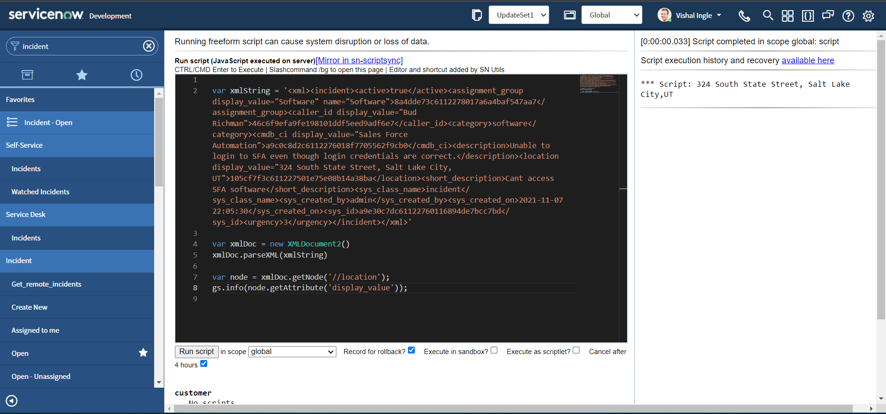

&nbsp;&nbsp;&nbsp;&nbsp;Now, Let us modify the script one more time to retrieve all attributes of element `assignment_group` as an object:

```js
var xmlString =
  '<xml><incident><active>true</active><assignment_group display_value="Software" name="Software">8a4dde73c6112278017a6a4baf547aa7</assignment_group><caller_id display_value="Bud Richman">46c6f9efa9fe198101ddf5eed9adf6e7</caller_id><category>software</category><cmdb_ci display_value="Sales Force Automation">a9c0c8d2c6112276018f7705562f9cb0</cmdb_ci><description>Unable to login to SFA even though login credentials are correct.</description><location display_value="324 South State Street, Salt Lake City,UT">105cf7f3c611227501e75e08b14a38ba</location><short_description>Cant access SFA software</short_description><sys_class_name>incident</sys_class_name><sys_created_by>admin</sys_created_by><sys_created_on>2021-11-07 22:05:30</sys_created_on><sys_id>a9e30c7dc61122760116894de7bcc7bd</sys_id><urgency>3</urgency></incident></xml>'

var xmlDoc = new XMLDocument2()
xmlDoc.parseXML(xmlString)

var node = xmlDoc.getNode("//assignment_group")
gs.info(node.getAttributes())
```

&nbsp;&nbsp;&nbsp;&nbsp;After executing the script, you should get an object logged to the output screen with all the attributes of `assignment_group` as properties with values.


### getFirstChild & getLastChild

&nbsp;&nbsp;&nbsp;&nbsp;**getFirstChild** gets the node's first child node. **getLastChild** gets the node's last child node. Let us modify our script to see this in action:

```js
var xmlString =
  '<xml><incident><active>true</active><assignment_group display_value="Software" name="Software">8a4dde73c6112278017a6a4baf547aa7</assignment_group><caller_id display_value="Bud Richman">46c6f9efa9fe198101ddf5eed9adf6e7</caller_id><category>software</category><cmdb_ci display_value="Sales Force Automation">a9c0c8d2c6112276018f7705562f9cb0</cmdb_ci><description>Unable to login to SFA even though login credentials are correct.</description><location display_value="324 South State Street, Salt Lake City,UT">105cf7f3c611227501e75e08b14a38ba</location><short_description>Cant access SFA software</short_description><sys_class_name>incident</sys_class_name><sys_created_by>admin</sys_created_by><sys_created_on>2021-11-07 22:05:30</sys_created_on><sys_id>a9e30c7dc61122760116894de7bcc7bd</sys_id><urgency>3</urgency></incident></xml>'

var xmlDoc = new XMLDocument2()
xmlDoc.parseXML(xmlString)

var node = xmlDoc.getNode("//incident")

gs.info(node.getFirstChild())

gs.info(node.getLastChild())
```

&nbsp;&nbsp;&nbsp;&nbsp;Once the script is executed you should see the output as below, indicating first child element and last child element of node `incident` :

```xml
<active>true</active>
<urgency>3</urgency>
```

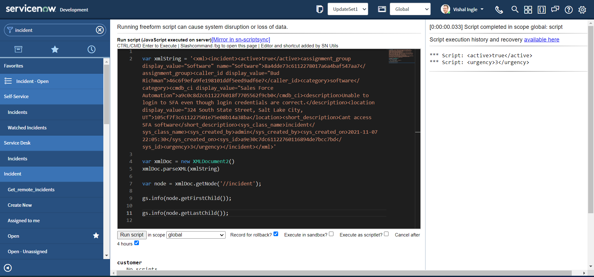

### getTextContent

&nbsp;&nbsp;&nbsp;&nbsp;**getTextContent** gets the text content of the current node. **The text content of a node consists of all the node's child text nodes.**

&nbsp;&nbsp;&nbsp;&nbsp;Let us modify our script to understand these better :

```js
var xmlString =
  '<xml><incident><active>true</active><assignment_group display_value="Software" name="Software">8a4dde73c6112278017a6a4baf547aa7</assignment_group><caller_id display_value="Bud Richman">46c6f9efa9fe198101ddf5eed9adf6e7</caller_id><category>software</category><cmdb_ci display_value="Sales Force Automation">a9c0c8d2c6112276018f7705562f9cb0</cmdb_ci><description>Unable to login to SFA even though login credentials are correct.</description><location display_value="324 South State Street, Salt Lake City,UT">105cf7f3c611227501e75e08b14a38ba</location><short_description>Cant access SFA software</short_description><sys_class_name>incident</sys_class_name><sys_created_by>admin</sys_created_by><sys_created_on>2021-11-07 22:05:30</sys_created_on><sys_id>a9e30c7dc61122760116894de7bcc7bd</sys_id><urgency>3</urgency></incident></xml>'

var xmlDoc = new XMLDocument2()
xmlDoc.parseXML(xmlString)

var rootNode = xmlDoc.getDocumentElement()

var firstNode = rootNode.getFirstChild()

gs.info(firstNode.getTextContent())

var shortDescription = xmlDoc.getNode("//short_description")
gs.info(shortDescription.getTextContent())
```

&nbsp;&nbsp;&nbsp;&nbsp;You should be receiving the output as following :
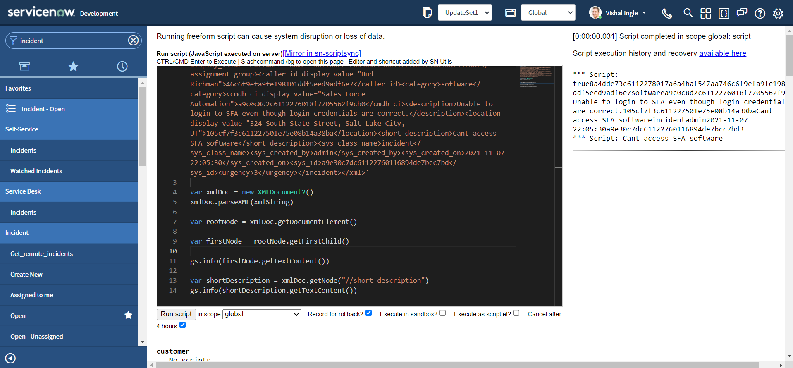

### hasAttribute

&nbsp;&nbsp;&nbsp;&nbsp;**hasAttribute** determines if the node has the specified attribute. Let us modify the script to see this method in action :

```js
var xmlString =
  '<xml><incident><active>true</active><assignment_group display_value="Software" name="Software">8a4dde73c6112278017a6a4baf547aa7</assignment_group><caller_id display_value="Bud Richman">46c6f9efa9fe198101ddf5eed9adf6e7</caller_id><category>software</category><cmdb_ci display_value="Sales Force Automation">a9c0c8d2c6112276018f7705562f9cb0</cmdb_ci><description>Unable to login to SFA even though login credentials are correct.</description><location display_value="324 South State Street, Salt Lake City,UT">105cf7f3c611227501e75e08b14a38ba</location><short_description>Cant access SFA software</short_description><sys_class_name>incident</sys_class_name><sys_created_by>admin</sys_created_by><sys_created_on>2021-11-07 22:05:30</sys_created_on><sys_id>a9e30c7dc61122760116894de7bcc7bd</sys_id><urgency>3</urgency></incident></xml>'

var xmlDoc = new XMLDocument2()
xmlDoc.parseXML(xmlString)

var locationNode = xmlDoc.getNode("//location")

gs.info(locationNode.hasAttribute("display_value"))

gs.info(locationNode.hasAttribute("display_name"))
```

&nbsp;&nbsp;&nbsp;&nbsp;After the excution of the script you should be able to see the output as follows:
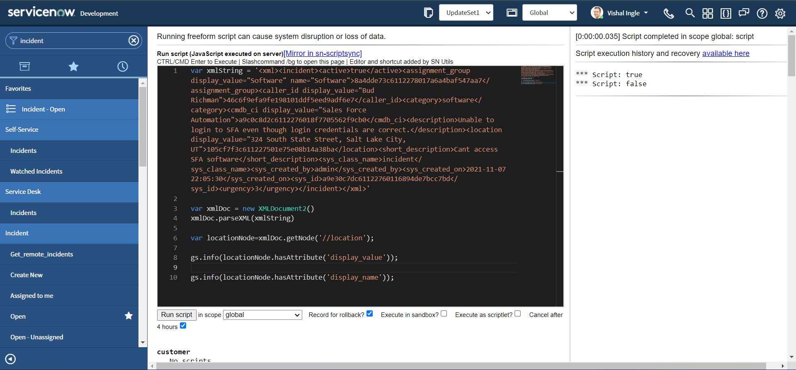

### setAttribute

```js
var xmlString =
  '<xml><incident><active>true</active><assignment_group display_value="Software" name="Software">8a4dde73c6112278017a6a4baf547aa7</assignment_group><caller_id display_value="Bud Richman">46c6f9efa9fe198101ddf5eed9adf6e7</caller_id><category>software</category><cmdb_ci display_value="Sales Force Automation">a9c0c8d2c6112276018f7705562f9cb0</cmdb_ci><description>Unable to login to SFA even though login credentials are correct.</description><location display_value="324 South State Street, Salt Lake City,UT">105cf7f3c611227501e75e08b14a38ba</location><short_description>Cant access SFA software</short_description><sys_class_name>incident</sys_class_name><sys_created_by>admin</sys_created_by><sys_created_on>2021-11-07 22:05:30</sys_created_on><sys_id>a9e30c7dc61122760116894de7bcc7bd</sys_id><urgency>3</urgency></incident></xml>'

var xmlDoc = new XMLDocument2()
xmlDoc.parseXML(xmlString)

var activeNode = xmlDoc.getNode("//active")
gs.info(activeNode.hasAttribute("state"))

activeNode.setAttribute("state", "open")

gs.info(activeNode.hasAttribute("state"))
gs.info(activeNode.getAttribute("state"))
gs.info(activeNode)
```

&nbsp;&nbsp;&nbsp;&nbsp;After executing above script you should receive the output as below, indicating a new attribute `state` has been added to the `active` node with the value of `open`:


### getChildNodeIterator & XMLNodeIterator

&nbsp;&nbsp;&nbsp;&nbsp;**getChildNodeIterator** gets a XMLNodeIterator object that can be used to walk through the list of child nodes. **The scoped XMLNodeIterator class allows you to iterate through a node of a XML document.** There are no constructors for creating a stand alone instance of a XMLNodeIterator object. To create a XMLNodeIterator object use the getChildNodeIterator() method of the XMLNode object. Let us assume the below example:

```js
var xmlString =
  '<xml><incident><active>true</active><assignment_group display_value="Software" name="Software">8a4dde73c6112278017a6a4baf547aa7</assignment_group><caller_id display_value="Bud Richman">46c6f9efa9fe198101ddf5eed9adf6e7</caller_id><category>software</category><cmdb_ci display_value="Sales Force Automation">a9c0c8d2c6112276018f7705562f9cb0</cmdb_ci><description>Unable to login to SFA even though login credentials are correct.</description><location display_value="324 South State Street, Salt Lake City,UT">105cf7f3c611227501e75e08b14a38ba</location><short_description>Cant access SFA software</short_description><sys_class_name>incident</sys_class_name><sys_created_by>admin</sys_created_by><sys_created_on>2021-11-07 22:05:30</sys_created_on><sys_id>a9e30c7dc61122760116894de7bcc7bd</sys_id><urgency>3</urgency></incident></xml>'

var xmlDoc = new XMLDocument2()
xmlDoc.parseXML(xmlString)

var node = xmlDoc.getNode("//incident")
var iter = node.getChildNodeIterator()
while (iter.hasNext()) {
  var currentNode = iter.next()
  gs.info(currentNode)
}
```

&nbsp;&nbsp;&nbsp;&nbsp;The ouput of these script logs all the nodes within the `incident` element :
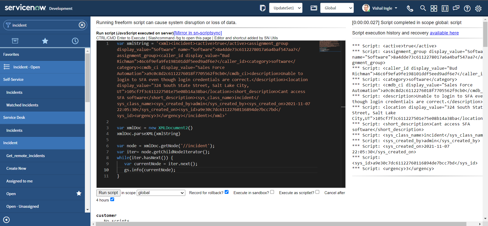

&nbsp;&nbsp;&nbsp;&nbsp;The **hasNext()** method in the above code returns true if the iteration has more elements. Similarly, **next()** method gets the next element in the iteration.

### getNodeName & getNodeValue

&nbsp;&nbsp;&nbsp;&nbsp;**getNodeName** gets the node's name. A node's name is determined by the node type. **A document-element node's name is #document. A text node's name is #text. An element node's name is the element's name.** **getNodeValue** gets the node's value. A node's value is also determined by the node type. **Element and document-element nodes return null.** Let us consider the below example from [ServiceNow API documentation](https://developer.servicenow.com/dev.do#!/reference/api/sandiego/server/no-namespace/c_XMLNodeScopedAPI):

```js
var xmlString =
  "<test>" +
  "  <one>" +
  '    <two att="xxx">abcd1234</two>' +
  '    <three boo="yah" att="yyy">1234abcd</three>' +
  "    <two>another</two>" +
  "  </one>" +
  "  <number>1234</number>" +
  "</test>"
var xmlDoc = new XMLDocument2()
xmlDoc.parseXML(xmlString)
var node = xmlDoc.getNode("//one")
var iter = node.getChildNodeIterator()
while (iter.hasNext()) {
  var n = iter.next()
  gs.info("Node name: " + n.getNodeName())
  gs.info("Node value: " + n.getNodeValue())
}
```

&nbsp;&nbsp;&nbsp;&nbsp;The above script should display the output as below:
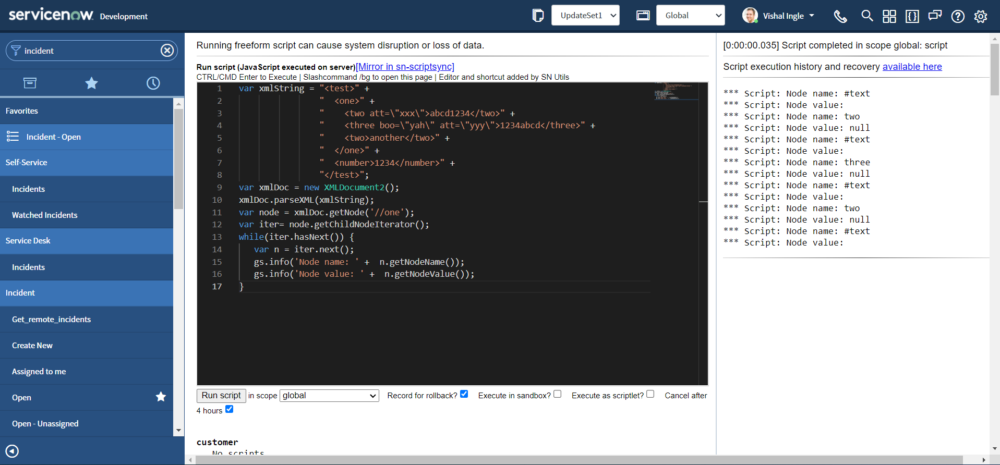

---

## Where can you dig more?

&nbsp;&nbsp;&nbsp;&nbsp;There is a lot of useful information about XML present on the internet. But some of the interesting resources which you should definitely visit are given below:

- [XML Tutorial](https://www.w3schools.com/xml/) by w3schools.com
- [Using XML](https://alistapart.com/article/usingxml/) by J. David Eisenberg
- [Introduction to the Annotated XML Specification](https://www.xml.com/axml/axml.html) by Tim Bray

---

## What's next?

&nbsp;&nbsp;&nbsp;&nbsp;Originally this chapter was very long but I splitted it into three chapters. After all it was not the best place to introduce you with all of that concepts right away. We will visit them as and when required. In the next chapter we will modify our script using REST Message, which is more better than coding everything in a script. See you in the next chapter.
