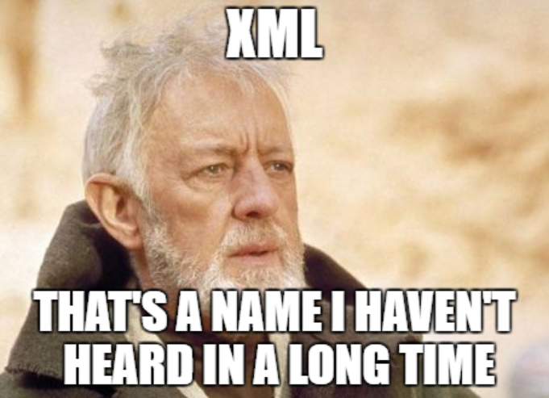
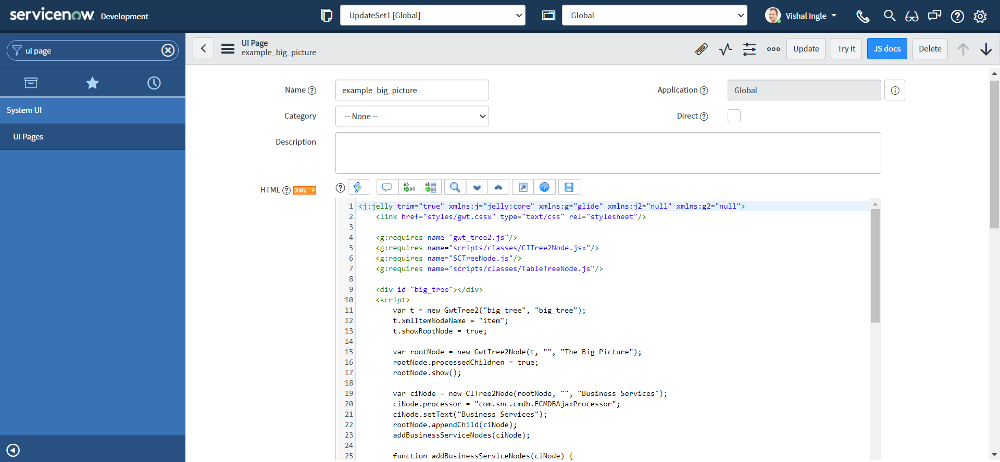

## Chapter 6

# Working With XMLs

&nbsp;&nbsp;&nbsp;&nbsp;So far, we have worked with easier JSON responses, but often we need to work with other types e.g. XML, YAML or CSV. Understanding how to work with XMLs is extermely important not only when you work with web services like RSS or SOAP, but also REST when you receive back the responses in XML format. In this chapter, we will try to learn some of the important concepts regarding XML that will help us to work with XML when we interact with them. Though it is going to be a lengthy journey, we will try to limit ourselves to only concepts essential to work with ServiceNow web services and it is extremely important that we understand them very well.



&nbsp;&nbsp;&nbsp;&nbsp;**XML** or **Extensible Markup Language** is a markup language much like HTML, but without predefined tags to use. Instead, you define your own tags designed specifically for your needs. **XML was designed and is a powerful way to store and transport data in a format that can be both human and machine-readable.** Because of the custom tags, it's something that humans can read and understand. Web services use XML to code and to decode data, and SOAP to transport it.

## Structure of an XML document

&nbsp;&nbsp;&nbsp;&nbsp;XML describes a class of data objects called XML documents. The whole structure of XML is built on tags. Consider the below example:

```xml
<?xml version="1.0" encoding="UTF-8"?>
<message>
    <warning>
         Hello World
    </warning>
</message>
```

&nbsp;&nbsp;&nbsp;&nbsp;The
document starts with a `<message>` tag, followed by a `<warning>` element that gives warning message `Hello World`. Also, The tags are closed in a sequence; `<message>` tag is closed after the `<warning>` tag with the use of `/` character.

&nbsp;&nbsp;&nbsp;&nbsp;However, notice the very first line of our example, which is also known as **XML prolog**:

```xml
<?xml version="1.0" encoding="UTF-8"?>
```

&nbsp;&nbsp;&nbsp;&nbsp;The above line of code is not a tag. It is used just for the transmission of the meta-data of a document i.e. version & character encoding used in the document. The XML prolog is optional. If it exists, it must come first in the document.

&nbsp;&nbsp;&nbsp;&nbsp;**XML documents form a tree structure that starts at "the root" and branches to "the leaves".** Let us consider another example, which is a note to Tove from Jani, stored as XML:

```xml
<?xml version="1.0" encoding="UTF-8"?>
<note>
  <to>Tove</to>
  <from>Jani</from>
  <content>
    <heading>Reminder</heading>
    <body>Don't forget me this weekend!</body>
  </content>
</note>
```

&nbsp;&nbsp;&nbsp;&nbsp;The XML above is quite self-descriptive:

- It has sender information i.e. `Jani`
- It has receiver information i.e. `Tove`
- It has a heading i.e. `Reminder`
- It has a message body i.e. `Don't forget me this weekend!`

&nbsp;&nbsp;&nbsp;&nbsp;The tags in the example above (like `<to>` and `<from>`) are not defined in any XML standard. These tags are "invented" by the author of the XML document.

&nbsp;&nbsp;&nbsp;&nbsp;The first line after the prolog defines the **root element** of the document:

```xml
<note>
```

&nbsp;&nbsp;&nbsp;&nbsp;The next line starts a `<to>` element:

```xml
<to>Tove</to>
```

&nbsp;&nbsp;&nbsp;&nbsp;The root i.e. `<note>` element have 3 child elements: `<to>`, `<from>` & `<content>`. Similarly, `<content>` have 2 child elements: `<heading>` and `<body>`.

&nbsp;&nbsp;&nbsp;&nbsp;One of the important point to remember here is, **XML stores data in plain text format**. This provides a software- and hardware-independent way of storing, transporting, and sharing data.

## The XML Tree Structure

&nbsp;&nbsp;&nbsp;&nbsp;An XML tree starts at a root element and branches from the root to child elements and all elements can have sub elements (child elements).

- The terms parent, child, and sibling are used to describe the relationships between elements.
- Parents have children.
- Children have parents.
- Siblings are children on the same level (brothers and sisters).
- All elements can have text content and attributes.

```xml
<root>
  <child>
    <subchild>.....</subchild>
  </child>
</root>
```

&nbsp;&nbsp;&nbsp;&nbsp;Consider the below image, copied from [w3schools.com](https://www.w3schools.com/xml/xml_tree.asp):

&nbsp;&nbsp;&nbsp;&nbsp;The image above represents books in this XML:

```xml
<?xml version="1.0" encoding="UTF-8"?>
<bookstore>
  <book category="cooking">
    <title lang="en">Everyday Italian</title>
    <author>Giada De Laurentiis</author>
    <year>2005</year>
    <price>30.00</price>
  </book>
  <book category="children">
    <title lang="en">Harry Potter</title>
    <author>J K. Rowling</author>
    <year>2005</year>
    <price>29.99</price>
  </book>
  <book category="web">
    <title lang="en">Learning XML</title>
    <author>Erik T. Ray</author>
    <year>2003</year>
    <price>39.95</price>
  </book>
</bookstore>
```

&nbsp;&nbsp;&nbsp;&nbsp;An XML element is everything from (including) the element's start tag to (including) the element's end tagand an element can contain:

- text
- attributes
- other elements
- a mix of the above

&nbsp;&nbsp;&nbsp;&nbsp;In the example above:

- `<title>`, `<author>`, `<year>`, and `<price>` have text content because they contain text (like 29.99).
- `<bookstore>` and `<book>` have element contents, because they contain elements.
- `<book>` has an attribute (`category="children"`).

&nbsp;&nbsp;&nbsp;&nbsp;An element with no content is said to be empty. In XML, you can indicate an empty element like this:

```xml
<element></element>
```

OR you can also use a so called self-closing tag:

```xml
<element />
```

&nbsp;&nbsp;&nbsp;&nbsp;XML elements can have attributes, designed to contain data related to a specific element. Attribute values must always be quoted. Either single or double quotes can be used. E.g. a date attribute is used in this example:

```xml
<note date="2008-01-10">
  <to>Tove</to>
  <from>Jani</from>
</note>
```

&nbsp;&nbsp;&nbsp;&nbsp;**The metadata (data about data) should be stored as attributes, and the data itself should be stored as elements.** E.g. The id attributes below are for identifying the different notes. It is not a part of the note itself.

```xml
<messages>
  <note id="501">
    <to>Tove</to>
    <from>Jani</from>
    <heading>Reminder</heading>
    <body>Don't forget me this weekend!</body>
  </note>
  <note id="502">
    <to>Jani</to>
    <from>Tove</from>
    <heading>Re: Reminder</heading>
    <body>I will not</body>
  </note>
</messages>
```

## XML design rules

&nbsp;&nbsp;&nbsp;&nbsp;XML document must be well-formed. XML documents that conform to the syntax rules below are said to be "Well Formed" XML documents:

- XML documents must contain one root element that is the parent of all other elements:

```xml
<root>
  <child>
    <subchild>.....</subchild>
  </child>
</root>
```

&nbsp;&nbsp;&nbsp;&nbsp;In this example `<note>` is the root element:

```xml
<?xml version="1.0" encoding="UTF-8"?>
<note>
  <to>Tove</to>
  <from>Jani</from>
  <heading>Reminder</heading>
  <body>Don't forget me this weekend!</body>
</note>
```

- Element names must start with a letter or underscore.

- Element names cannot start with the letters xml (or XML, or Xml, etc).

- Element names can contain letters, digits, hyphens, underscores, and periods.

- Element names cannot contain spaces.

- In XML, it is illegal to omit the closing tag. All elements must have a closing tag:

```xml
<p>This is a paragraph.</p>
<br />
```

- XML tags are case sensitive. The tag `<Letter>` is different from the tag `<letter>`. Opening and closing tags must be written with the same case:

```xml
<message>This is correct</message>
```

- In XML, all elements must be properly nested within each other. E.g. In the example below, "Properly nested" simply means that since the `<i>` element is opened inside the `<b>` element, it must be closed inside the `<b>` element:

```xml
<b><i>This text is bold and italic</i></b>
```

- XML elements can have attributes in name/value pairs just like in HTML. In XML, the attribute values must always be quoted:

```xml
<person gender="female">
```

- Some characters have a special meaning in XML, they should be replaced with an entity reference. E.g. If you place a character like "<" inside an XML element, it will generate an error because the parser interprets it as the start of a new element and it should be replaced with an entity reference `&lt;`:

```xml
<message>salary &lt; 1000</message>
```

- XML stores a new line as LF.

- Avoid "-". If you name something "first-name", some software may think you want to subtract "name" from "first".

- Avoid ".". If you name something "first.name", some software may think that "name" is a property of the object "first".

- Avoid ":". Colons are reserved for namespaces.

## XML Namespaces

&nbsp;&nbsp;&nbsp;&nbsp;**XML Namespaces provide a method to avoid element name conflicts.** In XML, element names are defined by the developer. This often results in a conflict when trying to mix XML documents from different XML applications.

&nbsp;&nbsp;&nbsp;&nbsp;This XML carries HTML table information:

```xml
<table>
  <tr>
    <td>Apples</td>
    <td>Bananas</td>
  </tr>
</table>
```

&nbsp;&nbsp;&nbsp;&nbsp;This XML carries information about a table (a piece of furniture):

```xml
<table>
  <name>African Coffee Table</name>
  <width>80</width>
  <length>120</length>
</table>
```

&nbsp;&nbsp;&nbsp;&nbsp; If these XML fragments were added together, there would be a name conflict. Both contain a <table> element, but the elements have different content and meaning. A user or an XML application will not know how to handle these differences:

```xml
<root>

    <table>
    <tr>
        <td>Apples</td>
        <td>Bananas</td>
    </tr>
    </table>

    <table>
    <name>African Coffee Table</name>
    <width>80</width>
    <length>120</length>
    </table>

</root>
```

&nbsp;&nbsp;&nbsp;&nbsp;Name conflicts in XML can easily be avoided using a name prefix. When using prefixes in XML, a namespace for the prefix must be defined using an xmlns attribute in the start tag of an element. The namespace declaration has the following syntax:

```xml
xmlns:prefix="URI"
```

&nbsp;&nbsp;&nbsp;&nbsp;In the example below, there will be no conflict because the two `<table>` elements have different names:

```xml
<root>

<h:table xmlns:h="http://www.w3.org/TR/html4/">
  <h:tr>
    <h:td>Apples</h:td>
    <h:td>Bananas</h:td>
  </h:tr>
</h:table>

<f:table xmlns:f="https://www.w3schools.com/furniture">
  <f:name>African Coffee Table</f:name>
  <f:width>80</f:width>
  <f:length>120</f:length>
</f:table>

</root>
```

&nbsp;&nbsp;&nbsp;&nbsp;Here,

- The xmlns attribute in the first `<table>` element gives the h: prefix a qualified namespace.
- The xmlns attribute in the second `<table>` element gives the f: prefix a qualified namespace.
- When a namespace is defined for an element, all child elements with the same prefix are associated with the same namespace.

&nbsp;&nbsp;&nbsp;&nbsp;Namespaces can also be declared in the XML root element:

```xml
<root xmlns:h="http://www.w3.org/TR/html4/"
xmlns:f="https://www.w3schools.com/furniture">

<h:table>
  <h:tr>
    <h:td>Apples</h:td>
    <h:td>Bananas</h:td>
  </h:tr>
</h:table>

<f:table>
  <f:name>African Coffee Table</f:name>
  <f:width>80</f:width>
  <f:length>120</f:length>
</f:table>

</root>
```

&nbsp;&nbsp;&nbsp;&nbsp;The namespace URI is not used by the parser to look up information. The purpose of using an URI is to give the namespace a unique name. However, It is often used as a pointer to a web page containing namespace information. XMLs are everywhere in ServiceNow platform, but the best place to find the use of namespaces is UI pages module:


## XML DOM

&nbsp;&nbsp;&nbsp;&nbsp;The **XML DOM defines a standard way for accessing and manipulating XML documents.** It presents an XML document as a tree-structure. The XML DOM is a standard for how to get, change, add, and delete XML elements. All XML elements can be accessed through the XML DOM. Understanding the DOM is a must for anyone working with XML.

## XML Parser

&nbsp;&nbsp;&nbsp;&nbsp;**XML parser** can convert text into an XML DOM object.

## XPath

&nbsp;&nbsp;&nbsp;&nbsp;**XPath can be used to navigate through elements and attributes in an XML document.** It uses path expressions to navigate in XML documents. These path expressions look very much like the expressions you see when you work with a traditional computer file system. Consider the below w3schools example:

```xml
<?xml version="1.0" encoding="UTF-8"?>

<bookstore>

<book category="cooking">
  <title lang="en">Everyday Italian</title>
  <author>Giada De Laurentiis</author>
  <year>2005</year>
  <price>30.00</price>
</book>

<book category="children">
  <title lang="en">Harry Potter</title>
  <author>J K. Rowling</author>
  <year>2005</year>
  <price>29.99</price>
</book>

<book category="web">
  <title lang="en">XQuery Kick Start</title>
  <author>James McGovern</author>
  <author>Per Bothner</author>
  <author>Kurt Cagle</author>
  <author>James Linn</author>
  <author>Vaidyanathan Nagarajan</author>
  <year>2003</year>
  <price>49.99</price>
</book>

<book category="web">
  <title lang="en">Learning XML</title>
  <author>Erik T. Ray</author>
  <year>2003</year>
  <price>39.95</price>
</book>

</bookstore>
```

&nbsp;&nbsp;&nbsp;&nbsp;In the table below we have listed some XPath expressions and the result of the expressions:

| XPath Expression                   | Result                                                                                                                                 |
| ---------------------------------- | -------------------------------------------------------------------------------------------------------------------------------------- |
| /bookstore/book[1]                 | Selects the first book element that is the child of the bookstore element                                                              |
| /bookstore/book[last()]            | Selects the last book element that is the child of the bookstore element                                                               |
| /bookstore/book[last()-1]          | Selects the last but one book element that is the child of the bookstore element                                                       |
| /bookstore/book[position()<3]      | Selects the first two book elements that are children of the bookstore element                                                         |
| //title[@lang]                     | Selects all the title elements that have an attribute named lang                                                                       |
| //title[@lang='en']                | Selects all the title elements that have a "lang" attribute with a value of "en"                                                       |
| /bookstore/book[price>35.00]       | Selects all the book elements of the bookstore element that have a price element with a value greater than 35.00                       |
| /bookstore/book[price>35.00]/title | Selects all the title elements of the book elements of the bookstore element that have a price element with a value greater than 35.00 |

## XQuery

&nbsp;&nbsp;&nbsp;&nbsp;XQuery was designed to query XML data. It is used for finding and extracting elements and attributes from XML documents. XQuery is to XML what SQL is to databases. It is built on XPath expressions and can be used to extract information to use in a Web Service.

```JS
for $x in doc("books.xml")/bookstore/book
where $x/price>30
order by $x/title
return $x/title
```

## XML Schema

&nbsp;&nbsp;&nbsp;&nbsp;**A document type definition defines the rules and the legal elements and attributes for an XML document.** A "valid" XML document must be well formed. In addition, it must conform to a document type definition.

&nbsp;&nbsp;&nbsp;&nbsp;There are two different document type definitions that can be used with XML:

- **DTD** - The original Document Type Definition
- **XML Schema** - An XML-based alternative to DTD

&nbsp;&nbsp;&nbsp;&nbsp;**An XML document validated against a DTD is both "Well Formed" and "Valid".**

### XML DTD

&nbsp;&nbsp;&nbsp;&nbsp;**A DTD or Document Type Definition defines the structure and the legal elements and attributes of an XML document.** With a DTD, you can verify that the data you receive from the outside world is valid. A "Valid" XML document is "Well Formed", as well as it conforms to the rules of a DTD. Look at this simple XML document called "note.xml", This XML document has a reference to a DTD:

```xml
<?xml version="1.0"?>

<!DOCTYPE note SYSTEM
"https://www.w3schools.com/xml/note.dtd">

<note>
  <to>Tove</to>
  <from>Jani</from>
  <heading>Reminder</heading>
  <body>Don't forget me this weekend!</body>
</note>
```

&nbsp;&nbsp;&nbsp;&nbsp;The following example is a DTD file called "note.dtd" that defines the elements of the XML document above ("note.xml"):

```xml
<!DOCTYPE note
[
<!ELEMENT note (to,from,heading,body)>
<!ELEMENT to (#PCDATA)>
<!ELEMENT from (#PCDATA)>
<!ELEMENT heading (#PCDATA)>
<!ELEMENT body (#PCDATA)>
]>
```

&nbsp;&nbsp;&nbsp;&nbsp;The purpose of a DTD is to define the structure and the legal elements and attributes of an XML document. The DTD above is interpreted like this:

- **!DOCTYPE note** - Defines that the root element of the document is note
- **!ELEMENT note** - Defines that the note element must contain the elements: "to, from, heading, body"
- **!ELEMENT to** - Defines the to element to be of type "#PCDATA"
- **!ELEMENT from** - Defines the from element to be of type "#PCDATA"
- **!ELEMENT heading** - Defines the heading element to be of type "#PCDATA"
- **!ELEMENT body** - Defines the body element to be of type "#PCDATA"

### XML Schema

&nbsp;&nbsp;&nbsp;&nbsp;XML Schema is an XML-based alternative to DTD. **An XML Schema describes the structure of an XML document, just like a DTD.** With XML Schema, your XML files can carry a description of its own format. An XML document validated against an XML Schema is both "Well Formed" and "Valid". Let us modify our XML document to have a reference to an XML Schema:

```xml
<?xml version="1.0"?>

<note
xmlns="https://www.w3schools.com"
xmlns:xsi="http://www.w3.org/2001/XMLSchema-instance"
xsi:schemaLocation="https://www.w3schools.com/xml note.xsd">
  <to>Tove</to>
  <from>Jani</from>
  <heading>Reminder</heading>
  <body>Don't forget me this weekend!</body>
</note>
```

&nbsp;&nbsp;&nbsp;&nbsp;The following example is an XML Schema file called "note.xsd" that defines the elements of the XML document above ("note.xml"):

```xml
<?xml version="1.0"?>
<xs:schema xmlns:xs="http://www.w3.org/2001/XMLSchema"
targetNamespace="https://www.w3schools.com"
xmlns="https://www.w3schools.com"
elementFormDefault="qualified">

<xs:element name="note">
  <xs:complexType>
    <xs:sequence>
      <xs:element name="to" type="xs:string"/>
      <xs:element name="from" type="xs:string"/>
      <xs:element name="heading" type="xs:string"/>
      <xs:element name="body" type="xs:string"/>
    </xs:sequence>
  </xs:complexType>
</xs:element>

</xs:schema>
```

&nbsp;&nbsp;&nbsp;&nbsp;The Schema above is interpreted like this:

- `<xs:element name="note">` defines the element called "note"
- `<xs:complexType>` the "note" element is a complex type
- `<xs:sequence>` the complex type is a sequence of elements
- `<xs:element name="to" type="xs:string">` the element "to" is of type string (text)
- `<xs:element name="from" type="xs:string">` the element "from" is of type string
- `<xs:element name="heading" type="xs:string">` the element "heading" is of type string
- `<xs:element name="body" type="xs:string">` the element "body" is of type string

&nbsp;&nbsp;&nbsp;&nbsp;The note element is a complex type because it contains other elements. The other elements (to, from, heading, body) are simple types because they do not contain other elements. The XML Schema language is also referred to as XML Schema Definition (XSD). The purpose of an XML Schema is to define the legal building blocks of an XML document:

- the elements and attributes that can appear in a document
- the number of (and order of) child elements
- data types for elements and attributes
- default and fixed values for elements and attributes

&nbsp;&nbsp;&nbsp;&nbsp;One of the greatest strength of XML Schemas is the support for data types:

- It is easier to describe allowable document content
- It is easier to validate the correctness of data
- It is easier to define data facets (restrictions on data)
- It is easier to define data patterns (data formats)
- It is easier to convert data between different data types

&nbsp;&nbsp;&nbsp;&nbsp;When sending data from a sender to a receiver, it is essential that both parts have the same "expectations" about the content. With XML Schemas, the sender can describe the data in a way that the receiver will understand. A date like: "03-11-2004" will, in some countries, be interpreted as 3 November and in other countries as 11 March. However, an XML element with a data type like this:
`<date type="date">2004-03-11</date>`
ensures a mutual understanding of the content, because the XML data type "date" requires the format "YYYY-MM-DD".

### The `<schema>` Element

&nbsp;&nbsp;&nbsp;&nbsp;The <schema> element is the root element of every XML Schema, The <schema> element may contain some attributes:

```xsd
<?xml version="1.0"?>

<xs:schema xmlns:xs="http://www.w3.org/2001/XMLSchema"
targetNamespace="https://www.w3schools.com"
xmlns="https://www.w3schools.com"
elementFormDefault="qualified">
...
...
</xs:schema>
```

- `xmlns:xs="http://www.w3.org/2001/XMLSchema"` indicates that the elements and data types used in the schema come from the `http://www.w3.org/2001/XMLSchema` namespace. It also specifies that the elements and data types that come from the `http://www.w3.org/2001/XMLSchema` namespace should be prefixed with `xs:`.
- `targetNamespace="https://www.w3schools.com"`
  indicates that the elements defined by this schema (note, to, from, heading, body.) come from the `https://www.w3schools.com` namespace.
- `xmlns="https://www.w3schools.com"`
  indicates that the default namespace is `https://www.w3schools.com`.
- `elementFormDefault="qualified"`
  indicates that any elements used by the XML instance document which were declared in this schema must be namespace qualified.

### Referencing a Schema in an XML Document

&nbsp;&nbsp;&nbsp;&nbsp;This XML document has a reference to an XML Schema:

```xml
<?xml version="1.0"?>

<note xmlns="https://www.w3schools.com"
xmlns:xsi="http://www.w3.org/2001/XMLSchema-instance"
xsi:schemaLocation="https://www.w3schools.com note.xsd">

<to>Tove</to>
<from>Jani</from>
<heading>Reminder</heading>
<body>Don't forget me this weekend!</body>
</note>
```

- `xmlns="https://www.w3schools.com"`
  specifies the default namespace declaration. This declaration tells the schema-validator that all the elements used in this XML document are declared in the `https://www.w3schools.com` namespace.

- Once you have the XML Schema Instance namespace available: `xmlns:xsi="http://www.w3.org/2001/XMLSchema-instance"`, you can use the `schemaLocation` attribute. This attribute has two values, separated by a space. The first value is the namespace to use. The second value is the location of the XML schema to use for that namespace: `xsi:schemaLocation="https://www.w3schools.com note.xsd"`

### XSD Simple Elements

&nbsp;&nbsp;&nbsp;&nbsp;XML Schemas define the elements of your XML files. **A simple element is an XML element that contains only text. It cannot contain any other elements or attributes.** However, the text can be of many different types. It can be one of the types included in the XML Schema definition (boolean, string, date, etc.), or it can be a custom type that you can define yourself. You can also add restrictions (facets) to a data type in order to limit its content, or you can require the data to match a specific pattern.

&nbsp;&nbsp;&nbsp;&nbsp;The syntax for defining a simple element is:

```xml
<xs:element name="xxx" type="yyy"/>
```

&nbsp;&nbsp;&nbsp;&nbsp;where xxx is the name of the element and yyy is the data type of the element.

&nbsp;&nbsp;&nbsp;&nbsp;XML Schema has a lot of built-in data types. The most common types are:

- xs:string
- xs:decimal
- xs:integer
- xs:boolean
- xs:date
- xs:time

&nbsp;&nbsp;&nbsp;&nbsp;Here is an example of some XML elements:

```xml
<lastname>Refsnes</lastname>
<age>36</age>
<dateborn>1970-03-27</dateborn>
```

&nbsp;&nbsp;&nbsp;&nbsp;The corresponding simple element definitions are:

```xsd
<xs:element name="lastname" type="xs:string"/>
<xs:element name="age" type="xs:integer"/>
<xs:element name="dateborn" type="xs:date"/>
```

&nbsp;&nbsp;&nbsp;&nbsp;Simple elements may have a default value OR a fixed value specified. A default value is automatically assigned to the element when no other value is specified; A fixed value is also automatically assigned to the element, and you cannot specify another value.

- In the following example the default value is "red":

```xml
<xs:element name="color" type="xs:string" default="red"/>
```

- In the following example the fixed value is "red":

```xml
<xs:element name="color" type="xs:string" fixed="red"/>
```

### XSD Attributes

&nbsp;&nbsp;&nbsp;&nbsp;Simple elements cannot have attributes. If an element has attributes, it is considered to be of a complex type. But the attribute itself is always declared as a simple type.

&nbsp;&nbsp;&nbsp;&nbsp;The syntax for defining an attribute is:

```xml
<xs:attribute name="xxx" type="yyy"/>
```

&nbsp;&nbsp;&nbsp;&nbsp;where xxx is the name of the attribute and yyy specifies the data type of the attribute.

&nbsp;&nbsp;&nbsp;&nbsp;XML Schema has a lot of built-in data types. The most common types are:

- xs:string
- xs:decimal
- xs:integer
- xs:boolean
- xs:date
- xs:time

&nbsp;&nbsp;&nbsp;&nbsp;Here is an example of an XML element with an attribute:

```xml
<lastname lang="EN">Smith</lastname>
```

&nbsp;&nbsp;&nbsp;&nbsp;The corresponding attribute definition is:

```xsd
<xs:attribute name="lang" type="xs:string"/>
```

&nbsp;&nbsp;&nbsp;&nbsp;Attributes may have a default value OR a fixed value specified. A default value is automatically assigned to the attribute when no other value is specified. A fixed value is also automatically assigned to the attribute, and you cannot specify another value.

- In the following example the default value is "EN":

```xml
<xs:attribute name="lang" type="xs:string" default="EN"/>
```

- In the following example the fixed value is "EN":

```xml
<xs:attribute name="lang" type="xs:string" fixed="EN"/>
```

&nbsp;&nbsp;&nbsp;&nbsp;Attributes are optional by default. To specify that the attribute is required, use the "use" attribute:

```xsd
<xs:attribute name="lang" type="xs:string" use="required"/>
```

### Restrictions on Content

&nbsp;&nbsp;&nbsp;&nbsp;**When an XML element or attribute has a data type defined, it puts restrictions on the element's or attribute's content.** If an XML element is of type "xs:date" and contains a string like "Hello World", the element will not validate. Restrictions are used to define acceptable values for XML elements or attributes. With XML Schemas, you can also add your own restrictions to your XML elements and attributes. **These restrictions are called facets.**

## Where can you dig more?

&nbsp;&nbsp;&nbsp;&nbsp;There is a lot of useful information about XML present on the internet. But some of the interesting resources which you should definitely visit are given below:

- [XML Tutorial](https://www.w3schools.com/xml/) by w3schools.com
- [Using XML](https://alistapart.com/article/usingxml/) by J. David Eisenberg
- [Introduction to the Annotated XML Specification](https://www.xml.com/axml/axml.html) by Tim Bray
